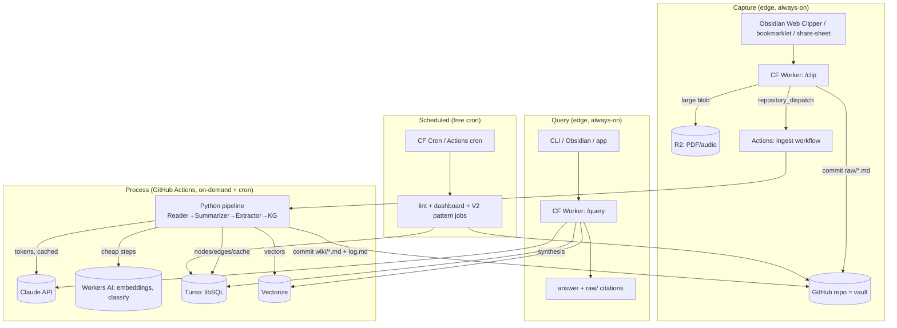

# AI-Assisted PKM — Cloud-Native, Near-Zero-Cost Data & Processing Architecture
**Companion to:** `PKM_Technical_Specification.md` (the local spec). This doc replaces the **data handling, storage, compute, orchestration, and retrieval** layers with managed free-tier cloud services. Everything else in the spec (ontology, agents, note schemas, naming, metadata) is unchanged.
**Free-tier limits verified:** June 2026. Re-verify before committing — free tiers move (PlanetScale eliminated theirs in 2025).
 
---
 
## 0. The one honest truth about cost
 
| Layer | Cloud service | Cost |
|-------|--------------|------|
| Vault storage (raw + wiki Markdown) | **GitHub** repo | **$0** |
| Compute / orchestration (ingest pipeline) | **GitHub Actions** | **$0** (within quota) |
| Always-on capture & query endpoints | **Cloudflare Workers** | **$0** (within quota) |
| Metadata + edge graph DB | **Turso** (libSQL/SQLite) | **$0** |
| Vector index | **Cloudflare Vectorize** *or* Turso native vectors | **$0** |
| Embeddings | **Cloudflare Workers AI** (bge models) | **$0** |
| Scheduled jobs (lint, dashboard, patterns) | **Cloudflare Cron** / GitHub cron | **$0** |
| Object storage for large raw blobs (PDF/audio) | **Cloudflare R2** | **$0** |
| **LLM synthesis (Claude)** | **Anthropic API** | **the only variable cost** |
 
> **Design consequence:** "near-zero cost" = drive Claude tokens toward zero. Two levers do this: (1) the **content-hash cache (AD-3)** makes every source cost LLM tokens *exactly once, ever*; (2) **model routing** sends mechanical steps (cleanup, classification, embeddings) to free Workers AI / a free LLM tier, reserving Claude only for synthesis and writing. At personal volume (~100–300 sources/month) the residual Claude bill is single-digit dollars, and can approach $0 if you route summarization to a free tier too.
 
**Durability is preserved.** The vault is still plain Markdown in a Git repo you can `git clone` to any disk at any time (file-over-app). Cloud handles *processing*; Git remains the *source of truth*. Kill every cloud service tomorrow and your knowledge is intact on your laptop.
 
---
 
## 1. Verified free-tier budget (June 2026)
 
| Service | Free allowance | What we use it for | Our projected load | Headroom |
|---------|---------------|--------------------|--------------------|----------|
| GitHub Actions (private repo) | 2,000 min/month | run the Python ingest pipeline | ~300 ingests × 3 min = 900 min + crons ≈ 950 min | ~2× |
| GitHub repo storage | 500 MB packages/artifacts; repo itself effectively free for text | the vault | Markdown is tiny; PDFs go to R2 | huge |
| Cloudflare Workers | 100K req/day, 10ms CPU, 50 subrequests | capture + query endpoints | <1K req/day | ~100× |
| Cloudflare Workers AI | 10K inferences/day (select models) | embeddings (bge-base) | 300 sources × 50 chunks ÷ 30 days ≈ 500/day | ~20× |
| Cloudflare Vectorize | 5M stored vectors; 30M queried dims/month | semantic retrieval (V1) | ~15K vectors; tiny query load | huge |
| Cloudflare R2 | 10 GB, 1M Class-A ops/mo, **no egress fees** | raw PDFs/audio/transcripts | a few GB | fine |
| Cloudflare Cron Triggers | included | nightly lint/dashboard/pattern jobs | ~30 runs/mo | fine |
| Turso (libSQL) | 5 GB, 500M row-reads/mo, 10M row-writes/mo | registry + claims + edges + LLM cache | ~9K writes/mo; reads bounded by indexes | large (if indexed) |
 
**The two free-tier traps to engineer around:**
1. **Turso meters every *row scanned*, not every query.** → Index every WHERE/JOIN column (Section 6.3). A full-table `COUNT(*)` on a big table burns reads. Keep large TEXT out of Turso.
2. **GitHub Actions private-repo minutes are finite (2,000/mo).** → Keep pipeline runs short; cache the Python venv; consider making the *engine* repo public (engine has no secrets) for unlimited minutes, while the *vault* stays private.
---
 
## 2. Target architecture
 



 
**Three runtime planes, each free:**
- **Edge plane (Cloudflare Workers):** always-on, sub-second, handles *capture* and *query*. Stateless; talks to Turso/Vectorize/Claude.
- **Batch plane (GitHub Actions):** the heavy Python pipeline, runs only when there's work (push to `raw/` or cron). Reuses the spec's existing Python code unchanged.
- **Truth plane (Git):** the durable Markdown vault; the only irreplaceable asset.
---
 
## 2.1 No local daemon required — your Mac runs nothing in the background
 
Nothing runs continuously on your machine. This design deletes the only two components of the local spec that would have needed a background process: the localhost FastAPI server (now Cloudflare Workers) and the local n8n instance (now GitHub Actions). Both now live on always-on managed infrastructure at $0.
 
Your Mac participates **only on demand, when you act**:
 
| Activity | What runs | Where it runs | Mac needed? |
|----------|-----------|---------------|-------------|
| Capture a source | browser extension / bookmarklet → CF Worker | browser + edge | click only; Mac can sleep right after |
| Process / synthesize | Python pipeline | GitHub Actions | **no** — runs while the Mac is asleep or off |
| Query | CF query Worker | edge | a URL call; no local server |
| Read / edit notes | Obsidian *or* browser `github.dev` | desktop app or browser | opened on demand, closed when done — **not a daemon** |
| Git sync | Obsidian Git plugin (only while Obsidian is open) | desktop | **optional** — pipeline reads from GitHub, never your Mac |
 
**Key property:** the automated pipeline reads from GitHub, not from your machine, so capture and synthesis continue whether your laptop is on, asleep, or shut. Local git sync exists purely for your own reading convenience and is not a runtime dependency. If you want *zero* local footprint, skip the local clone entirely: read rendered Markdown on GitHub and edit via `github.dev` (press `.` on the repo) — your Mac then runs nothing but a browser tab. There is no menu-bar agent, no cron on your machine, no always-open terminal, no local server.
 
---
 
## 3. Data handling — where each data class lives
 
| Data class | Home | Why | Format |
|-----------|------|-----|--------|
| Raw captured text (article/transcript/notes) | **GitHub `raw/`** (write-once) | durable, diffable, file-over-app, free | Markdown |
| Large raw binaries (PDF, audio, video) | **R2**, referenced by URL in the raw `.md` | Git repos shouldn't hold big binaries; R2 has no egress fee | binary |
| Synthesized pages (wiki concepts/sources/insights) | **GitHub `wiki/`** | human-editable, durable, Obsidian renders it | Markdown |
| Source registry (id, hash, paths, dates, status) | **Turso** | queryable, idempotency lookups, joins | SQL rows |
| Claims + typed edges (the graph) | **Turso** `claim`, `edge` tables | recursive-CTE traversal; cheap at this scale | SQL rows |
| LLM response cache (idempotency, AD-3) | **Turso** `llm_cache` | makes re-ingest free; shared by Actions + Workers | SQL rows |
| Embeddings | **Vectorize** (or Turso `F32_BLOB` vectors) | ANN search; free | vector |
| Catalog / timeline (`index.md`, `log.md`, `dashboard.md`) | **GitHub** | human-navigable, append-only audit | Markdown |
| Secrets (API keys, tokens) | **GitHub Secrets + Worker secrets** | never in repo | encrypted |
 
**Rule:** Turso holds *metadata and relationships only* — never the full source text. Full text lives in Git/R2. This keeps Turso storage tiny and, more importantly, keeps row-read counts low (you never scan big text columns).
 
---
 
## 4. Capture flow (Cloudflare Worker → Git)
 
A single Worker accepts a clip and lands it as an immutable `raw/` file, then triggers processing. ~30 lines.
 

```javascript
// worker-clip.js  (Cloudflare Worker, free tier)
export default {
  async fetch(req, env) {
    if (req.method !== "POST") return new Response("POST only", { status: 405 });
    const { url, type, text, title } = await req.json();
 
    // 1. Optionally stash a big blob in R2
    let r2key = null;
    if (text && text.length > 200_000) {
      r2key = `blobs/${crypto.randomUUID()}.txt`;
      await env.RAW_BUCKET.put(r2key, text);
    }
 
    // 2. Build the raw/ file (write-once) and commit to GitHub via API
    const date = new Date().toISOString().slice(0, 10);
    const slug = (title || url).toLowerCase().replace(/[^a-z0-9]+/g, "-").slice(0, 60);
    const sha8 = (await sha256(text || url)).slice(0, 8);
    const path = `raw/${date}_${slug}_${sha8}.md`;
    const body = frontMatter({ url, type, title, date, r2key, sha8 }) + (r2key ? `\n[blob in R2: ${r2key}]` : text);
 
    await commitToGitHub(env, path, body, `clip: ${slug}`);   // PUT /repos/:o/:r/contents/:path
 
    // 3. Trigger the Actions pipeline (only when there's work → saves minutes)
    await dispatch(env, "ingest", { path });                  // POST /repos/:o/:r/dispatches
    return Response.json({ ok: true, path });
  }
};
```

Secrets (`GITHUB_TOKEN`, repo owner/name) are Worker secrets. The clipper/bookmarklet just `POST`s `{url, text, type}` to the Worker URL.
 
---
 
## 5. Processing flow (GitHub Actions, reuses the spec's Python verbatim)
 
The pipeline is the *same* `pkm/pipeline/ingest.py` from the local spec. The only change is config: point it at Turso instead of a local SQLite file, and at Vectorize/Workers AI for embeddings.
 

```yaml
# .github/workflows/ingest.yml
name: ingest
on:
  repository_dispatch: { types: [ingest] }   # fired by the capture Worker
  push: { paths: ["raw/**"] }                # fallback: direct git push to raw/
  schedule: [{ cron: "0 3 * * *" }]          # nightly catch-up + lint + dashboard
permissions: { contents: write }             # commit wiki/ back
concurrency: { group: ingest, cancel-in-progress: false }  # serialize → idempotent
 
jobs:
  run:
    runs-on: ubuntu-latest
    timeout-minutes: 10                       # guard the 2000-min budget
    steps:
      - uses: actions/checkout@v4
      - uses: actions/setup-python@v5
        with: { python-version: "3.11", cache: "pip" }
      - run: pip install -e .
      - name: ingest new raw files
        env:
          ANTHROPIC_API_KEY: ${{ secrets.ANTHROPIC_API_KEY }}
          TURSO_URL:         ${{ secrets.TURSO_URL }}
          TURSO_TOKEN:       ${{ secrets.TURSO_TOKEN }}
          CF_ACCOUNT_ID:     ${{ secrets.CF_ACCOUNT_ID }}
          CF_API_TOKEN:      ${{ secrets.CF_API_TOKEN }}   # Workers AI + Vectorize
        run: pkm ingest --new-only            # processes only un-ingested raw/ files
      - name: commit synthesized wiki
        run: |
          git config user.name "pkm-bot"; git config user.email "bot@local"
          git add wiki/ index.md log.md dashboard.md
          git commit -m "synthesize: $(date -u +%FT%TZ)" || echo "nothing to commit"
          git push
```

 
**Why Actions for the heavy work:** it's free, it runs the *exact* Python from the local spec (no rewrite to JS), and it's only billed while running — pushing to `raw/` is the trigger, so idle costs nothing. `concurrency` serializes runs so two ingests can't race the graph (preserves idempotency, AD-3/P21).
 
---
 
## 6. Database — migrate SQLite → Turso (a ~5-line change)
 
Turso *is* SQLite (libSQL). The spec's `schema.sql` runs unchanged. Only the connection changes.
 
### 6.1 Connection

```python
# db/registry.py  — the ONLY change from the local spec
import libsql_experimental as libsql   # pip install libsql-experimental
def connect(settings):
    if settings.turso_url:                       # cloud
        return libsql.connect(database=settings.turso_url, auth_token=settings.turso_token)
    return libsql.connect(settings.db_path)      # local fallback (offline dev)
```

All DDL, the `edge` table, recursive-CTE traversal, triggers, and the `llm_cache` table from the spec are byte-for-byte identical. The `raw_path` immutability trigger still works.
 
### 6.2 Embedded-replica option (zero-latency reads, still free)
For the query Worker, Turso embedded replicas sync a local copy and serve reads with no network hop. At our volume the plain remote connection is fine; note it as a V1 optimization, not MVP.
 
### 6.3 Row-read discipline (the Turso free-tier trap)
- Index every column used in WHERE/JOIN (the spec already indexes `claim.source_id`, `edge.src/dst`, `edge.type`, `claim.status`).
- **Never** store full source text in Turso — only `raw_path` pointers (text is in Git/R2).
- Replace `SELECT COUNT(*) FROM big_table` dashboards with incrementally-maintained counter rows updated on write.
- Cap recursive-CTE `max_hops` (default 3) so traversals don't fan out into millions of row-reads.
---
 
## 7. Embeddings & vector retrieval — free
 
### 7.1 Embeddings via Workers AI (no per-token cost)

```python
# retrieval/embed.py
import httpx
def embed(texts: list[str], settings) -> list[list[float]]:
    r = httpx.post(
        f"https://api.cloudflare.com/client/v4/accounts/{settings.cf_account}/ai/run/@cf/baai/bge-base-en-v1.5",
        headers={"Authorization": f"Bearer {settings.cf_token}"},
        json={"text": texts})
    return [d["embedding"] for d in r.json()["result"]["data"]]   # 768-dim
```

~500 embeddings/day at our volume vs a 10K/day free ceiling → 20× headroom.
 
### 7.2 Vector store — two free options
- **Cloudflare Vectorize** (recommended): purpose-built ANN, 5M vectors free, queried from the query Worker with zero extra infra. Upsert during ingest with `{id: claim_id, values: emb, metadata: {source_id, concept}}`.
- **Turso native vectors** (simpler, one DB): store `F32_BLOB(768)` column + `vector_top_k()` index. Keeps everything in one place; fine to a few hundred-thousand vectors.
Choose Vectorize if the query path is a Worker (edge); choose Turso vectors if you want a single store and query from Actions/CLI.
 
---
 
## 8. LLM cost minimization (driving the only bill toward $0)
 
Ordered by impact:
 
1. **Hash-cache everything (AD-3).** `llm_cache` keyed on `sha256(agent+model+prompt_version+input)` lives in Turso, shared across Actions runs and Workers. A source is summarized/extracted **once ever**; re-ingest, lint, and retries are free. This alone removes ~all repeat cost.
2. **Route mechanical steps off Claude.** Reader cleanup, claim-type classification, and embeddings → **Workers AI (free)** or a **free LLM tier** (e.g. Gemini/Groq free tiers). Reserve Claude (Sonnet/Opus) for *synthesis* steps where quality compounds: concept-page writing, insight generation, the Writer agent. Configurable per-agent in `settings.yaml`:
   ```yaml
   models:
     reader:            "@cf/meta/llama-3.1-8b-instruct"   # free Workers AI
     concept_extractor: "claude-sonnet-4-6"                # quality matters
     summarizer:        "claude-sonnet-4-6"
     writer:            "claude-opus-4-8"
   ```
3. **Batch + cap context.** Summarize per-source in one call; don't re-feed the whole vault. Long-context retrieval selects only linked/tagged pages (spec MVP), keeping input tokens bounded.
4. **Gate expensive agents behind human acceptance.** Writer/Opportunity/Investment (V3) run only on demand, never on every ingest.
> **Order-of-magnitude:** at ~200 sources/month with mechanical steps on free models and only extract+synthesis on Sonnet, expect a few dollars/month; with summarization also routed to a free tier, cents. **Verify current Anthropic API pricing before budgeting** — token prices change and aren't quoted here on purpose. If even that must be $0, run *all* steps on Workers AI / a free LLM tier and use Claude only for ad-hoc queries you personally trigger.
 
---
 
## 9. Query flow (Cloudflare Worker, always-on, free)
 

```javascript
// worker-query.js
export default {
  async fetch(req, env) {
    const q = new URL(req.url).searchParams.get("q");
    const qvec = await aiEmbed(env, q);                       // Workers AI (free)
    const hits = await env.VEC.query(qvec, { topK: 12, returnMetadata: true });  // Vectorize
    const ids  = hits.matches.map(m => m.metadata.source_id);
    const ctx  = await turso(env, `SELECT text, raw_path FROM claim
                                   WHERE source_id IN (${ids.map(()=>"?").join(",")})
                                   AND status='accepted'`, ids);  // indexed → cheap reads
    const ans  = await claude(env, buildPrompt(q, ctx));      // synthesis + citations
    return Response.json({ answer: ans, citations: ctx.map(c => c.raw_path) });
  }
};
```

Edge-resident, sub-second, free within 100K req/day. V2 swaps the retrieval step for GraphRAG global queries (run in Actions, summaries cached in Turso/R2 for the Worker to read).
 
---
 
## 10. Scheduled jobs (free cron)
 
| Job | Schedule | Runner | Action |
|-----|----------|--------|--------|
| Catch-up ingest | nightly | Actions cron | process any `raw/` missed by dispatch |
| Lint (broken links, orphans, missing provenance) | nightly | Actions cron | write failures to `log.md` |
| Dashboard (output counts, cost, contradiction/orphan queues) | nightly | Actions cron | regenerate `dashboard.md` |
| Pattern detection (V2) | weekly | Actions cron | cluster claims, write Pattern nodes |
| Embedded-replica refresh / vector reindex | as needed | Actions | rebuild Vectorize from Turso |
 
Cloudflare Cron Triggers can host the light edge jobs; Actions cron hosts anything needing the Python pipeline. Both free.
 
---
 
## 11. Security & secrets
 
- **Vault repo: private.** Secrets never committed.
- **Secret stores:** `ANTHROPIC_API_KEY`, `TURSO_URL/TOKEN`, `CF_API_TOKEN` in **GitHub Actions Secrets**; the capture/query Workers hold their own copies as **Worker Secrets** (`wrangler secret put`).
- **GitHub token** used by the Worker is a fine-grained PAT scoped to *contents:write* on the one vault repo.
- **Turso auth token** scoped to the single database; rotate via `turso db tokens create`.
- **Cloudflare API token** scoped to Workers AI + Vectorize only.
- Worker endpoints protected by a shared secret header (`X-PKM-Key`) so only your clipper can POST.
---
 
## 12. Migration delta from the local spec (what actually changes)
 
| Spec section | Local version | Cloud version | Code change |
|--------------|---------------|---------------|-------------|
| Repo structure | two repos | **same** + `worker-clip.js`, `worker-query.js`, `.github/workflows/` | additive |
| DB schema (§2) | local SQLite file | **Turso** | connection string only |
| Markdown schema (§3) | local vault | **GitHub-hosted vault** | none |
| KG schema (§4) | edge table in SQLite | **edge table in Turso** | none |
| API (§5) | FastAPI on localhost | **Cloudflare Workers** for `/clip`, `/query`; Actions for `/ingest` | reimplement 2 endpoints in JS; pipeline unchanged |
| Agents (§6) | local Python | **same Python in Actions**; mechanical agents → Workers AI | model routing in `settings.yaml` |
| Orchestration | n8n local | **GitHub Actions** (dispatch + cron) | replace n8n flows with `ingest.yml` |
| Retrieval | local long-context | **Vectorize + Workers AI + Claude** in query Worker | new embed/vector calls |
| Storage | local disk | **Git + R2** | blob offload in `/clip` |
 
**Net:** the Python pipeline, ontology, schemas, and agent prompts are reused verbatim. The new code is two small Workers and one Actions workflow. n8n is dropped (Actions + Cron replace it at $0 and with version control).
 
---
 
## 13. Free-tier guardrails (fail safe, never surprise-bill)
 
- **Cloudflare free tier stops, doesn't bill** — Workers simply return errors past 100K/day; no overage charge. Set no paid plan.
- **GitHub Actions:** set the account **spending limit to $0** so private-repo minutes hard-stop at 2,000 rather than billing. Add a dashboard alert at 80%.
- **Turso:** stays on the free plan; monitor row-reads via `turso db inspect`. The "keep text out of Turso + index everything" rules keep reads far under 500M/mo.
- **Anthropic:** set a **monthly spend cap** in the console; route to free models if the cap is the binding constraint.
- **Backups:** `git push` the vault to a second remote nightly (the vault is the only irreplaceable asset; Turso and Vectorize are rebuildable from `raw/`).
---
 
## 14. Build order (cloud MVP)
 
1. **GitHub:** create private `pkm-vault`; create Turso DB (`turso db create pkm`); run `schema.sql`.
2. **Actions:** add `ingest.yml`; set secrets; push a test file to `raw/` → confirm wiki page + Turso rows appear, re-push is a no-op (idempotency).
3. **Capture Worker:** deploy `worker-clip.js` via `wrangler`; point Obsidian Web Clipper / a bookmarklet at it; clip an article → confirm it lands in `raw/` and triggers Actions.
4. **Embeddings + Vectorize:** wire `embed.py` and upsert during ingest (V1).
5. **Query Worker:** deploy `worker-query.js`; `curl "$WORKER/query?q=..."` returns an answer with `raw/` citations.
6. **Cron:** enable nightly lint + dashboard.
7. **Guardrails:** set $0 spend limits on GitHub + Anthropic cap; add the 80% Actions-minutes alert; second git remote for backup.
**Definition of done:** clipping a source anywhere produces a synthesized, linked, cited wiki page with **zero local compute and $0 infrastructure cost**, the only spend being capped Claude tokens — and the entire vault remains a plain-Markdown Git repo you can clone and run locally if every cloud service vanishes.
