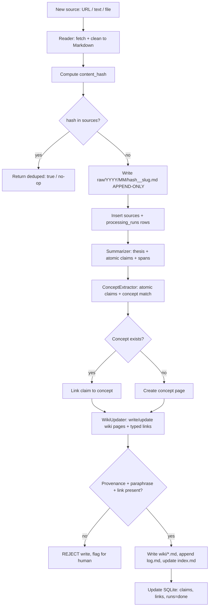
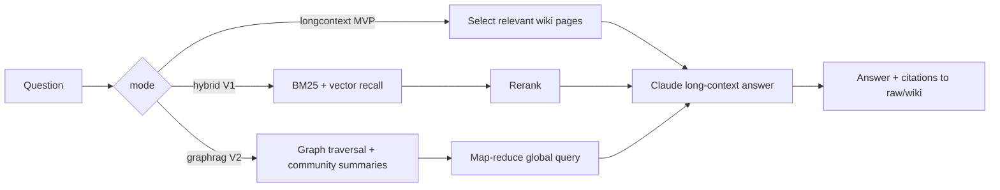
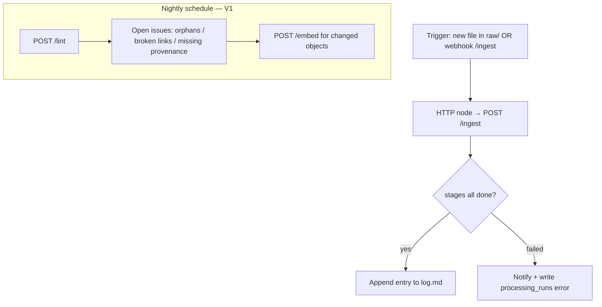

# AI-Assisted PKM System — Technical Build Specification

> **Status:** Authoritative build spec, v1.0
> **Audience:** Implementing engineer(s) + Claude Code
> **Source of design intent:** *AI-Assisted Personal Knowledge Management: Research Synthesis & Build Blueprint*
> **Architect's invariants (non-negotiable):**
> 1. **Markdown is the system of record for knowledge.** SQLite is the system of record for processing state + provenance. Neo4j/Chroma (later phases) are *derived projections*, fully rebuildable from Markdown + SQLite.
> 2. **`raw/` is append-only and immutable.** Never edited, never deleted by the system.
> 3. **Ingestion is idempotent, keyed on content hash.** Re-running the pipeline on the same input is a no-op.
> 4. **Nothing enters `wiki/` un-synthesized.** Capture without paraphrase+link is rejected (anti–Collector's-Fallacy).
> 5. **AI proposes; human disposes** on framing, insight acceptance, contradictions, and decisions.
> 6. **No graph, no vectors at MVP.** Both are gated behind explicit promotion thresholds.

---

## Phasing model (governs the entire spec)

| Phase | Stores | Retrieval | Agents | Promotion trigger |
|---|---|---|---|---|
| **MVP** | Markdown + SQLite | Long-context Claude over selected wiki pages | Reader, Summarizer, ConceptExtractor, WikiUpdater | Querying weekly **and** (`source_count ≥ 150` **or** recurring questions long-context can't answer) |
| **V1** | + ChromaDB | + hybrid (BM25 + vector) | + Retrieval, Writing; +12 templates; nightly lint | Relational / multi-hop / "what's changing" questions appear |
| **V2** | + Neo4j (GraphRAG) | + graph traversal + community summaries | + KnowledgeGraph, Pattern, Contrarian | Graph reliably answers cross-source questions; want active generation |
| **V3** | (+ optional Weaviate) | full GraphRAG local+global | + Opportunity, Investment, coordinator orchestration | — |

Sections below specify the **full target architecture** but flag each element with its phase tag `[MVP] [V1] [V2] [V3]`. **Build only MVP-tagged items first.**

---

## 1. Repository Structure

Monorepo. The Obsidian vault lives inside the repo and is git-tracked (knowledge is versioned alongside code).

```
pkm-system/
├── README.md
├── pyproject.toml                 # uv/poetry; package = "pkm"
├── .env.example
├── .gitignore                     # excludes .obsidian/workspace*, __pycache__, .chroma/, neo4j/data
├── Makefile                       # make ingest | lint | test | serve | rebuild-projections
│
├── config/
│   ├── settings.yaml              # paths, model names, thresholds, phase flags
│   └── prompts/                   # one .md per agent prompt (version-controlled)
│       ├── reader.md
│       ├── summarizer.md
│       ├── concept_extractor.md
│       ├── wiki_updater.md
│       ├── kg_extractor.md        # [V2]
│       ├── contrarian.md          # [V2]
│       ├── opportunity.md         # [V3]
│       └── investment.md          # [V3]
│
├── vault/                         # ── SYSTEM OF RECORD FOR KNOWLEDGE ──
│   ├── SCHEMA.md                  # ontology + page rules + ingestion rules (the "CLAUDE.md")
│   ├── index.md                   # catalog (AI-maintained, human-navigable)
│   ├── log.md                     # append-only event timeline
│   ├── raw/                       # APPEND-ONLY immutable source captures
│   │   └── YYYY/MM/<hash8>__<slug>.md
│   ├── wiki/                      # AI-maintained synthesized pages
│   │   ├── concepts/
│   │   ├── sources/
│   │   ├── entities/              # companies, people, industries
│   │   ├── models/                # mental models / frameworks
│   │   ├── insights/              # [V2]
│   │   ├── opportunities/         # [V3]
│   │   └── decisions/
│   └── templates/                 # the 12 note templates (Part 6)
│
├── src/pkm/
│   ├── __init__.py
│   ├── cli.py                     # Typer CLI: pkm ingest / lint / query / rebuild
│   ├── config.py                  # loads settings.yaml + .env into a typed Settings object
│   ├── models/                    # Pydantic models = the contracts between stages
│   │   ├── source.py
│   │   ├── summary.py
│   │   ├── claim.py
│   │   ├── concept.py
│   │   ├── entity.py
│   │   ├── edge.py                # [V2]
│   │   └── enums.py
│   ├── llm/
│   │   ├── client.py              # Claude API wrapper, structured-output enforcement, retries
│   │   └── prompts.py             # loads config/prompts/*.md, fills schema placeholders
│   ├── agents/
│   │   ├── base.py                # Agent ABC: role, input_schema, output_schema, run()
│   │   ├── reader.py
│   │   ├── summarizer.py
│   │   ├── concept_extractor.py
│   │   ├── wiki_updater.py
│   │   ├── retrieval.py           # [V1]
│   │   ├── writing.py             # [V1]
│   │   ├── knowledge_graph.py     # [V2]
│   │   ├── pattern.py             # [V2]
│   │   ├── contrarian.py          # [V2]
│   │   ├── opportunity.py         # [V3]
│   │   └── investment.py          # [V3]
│   ├── ingest/
│   │   ├── pipeline.py            # orchestrates Reader→Summarizer→Extractor→WikiUpdater
│   │   ├── hashing.py             # canonical content hash
│   │   ├── fetchers.py            # url/pdf/youtube/podcast → raw text
│   │   └── markdown_io.py         # front-matter read/write (python-frontmatter)
│   ├── store/
│   │   ├── sqlite.py              # registry + processing state (MVP system of record)
│   │   ├── chroma.py              # [V1] vector index adapter
│   │   ├── neo4j.py               # [V2] graph adapter
│   │   └── repository.py          # façade so callers don't know which backend
│   ├── retrieval/
│   │   ├── longcontext.py         # [MVP] assemble selected wiki pages into context
│   │   ├── hybrid.py              # [V1] BM25 + vector + rerank
│   │   └── graphrag.py            # [V2] local + global queries
│   └── lint/
│       └── checks.py              # [V1] orphan notes, broken links, missing provenance
│
├── migrations/                    # SQL migration files, applied in order
│   ├── 0001_init.sql
│   ├── 0002_claims.sql
│   └── 0003_chroma_sync.sql       # [V1]
│
├── n8n/
│   └── flows/
│       ├── ingest_on_new_raw.json
│       ├── nightly_lint.json      # [V1]
│       └── weekly_resurface.json  # [V3]
│
├── scripts/
│   ├── rebuild_projections.py     # [V2] rebuild Neo4j + Chroma from Markdown + SQLite
│   └── seed_schema_md.py
│
└── tests/
    ├── fixtures/
    ├── test_hashing.py
    ├── test_idempotency.py
    ├── test_pipeline.py
    └── test_markdown_io.py
```

**Rationale notes for the engineer**
- `store/repository.py` is a façade. MVP wires it to SQLite + Markdown only; later phases register Chroma/Neo4j adapters behind the same interface so call sites never change.
- `config/prompts/*.md` are version-controlled and loaded at runtime so prompt edits are diffable and don't require code changes.
- Everything in `migrations/` is forward-only; never edit an applied migration.

---

## 2. Database Schema (SQLite — `[MVP]`, extended through `[V2]`)

SQLite file at `vault/.pkm/registry.db` (sibling to the vault; excluded from Obsidian indexing). Use WAL mode. All timestamps are ISO-8601 UTC strings. All IDs are ULIDs (sortable, no coordination) except where a natural key exists.

```sql
-- migrations/0001_init.sql  [MVP]
PRAGMA journal_mode = WAL;
PRAGMA foreign_keys = ON;

-- ── Source registry: one row per ingested source ──
CREATE TABLE sources (
    id              TEXT PRIMARY KEY,          -- ulid, "src_..."
    content_hash    TEXT NOT NULL UNIQUE,      -- sha256 of canonicalized raw text (idempotency key)
    title           TEXT,
    author          TEXT,
    url             TEXT,
    source_type     TEXT NOT NULL,             -- enum: article|book|paper|newsletter|podcast|meeting|note
    date_published  TEXT,
    date_saved      TEXT NOT NULL,
    raw_path        TEXT NOT NULL,             -- vault-relative path, e.g. raw/2026/06/a1b2c3d4__title.md
    credibility     REAL,                      -- 0..1, nullable
    tags            TEXT,                       -- JSON array
    created_at      TEXT NOT NULL,
    updated_at      TEXT NOT NULL
);
CREATE INDEX idx_sources_type ON sources(source_type);
CREATE INDEX idx_sources_saved ON sources(date_saved);

-- ── Processing state machine: makes ingestion idempotent + resumable ──
CREATE TABLE processing_runs (
    id              TEXT PRIMARY KEY,          -- ulid
    source_id       TEXT NOT NULL REFERENCES sources(id) ON DELETE CASCADE,
    stage           TEXT NOT NULL,             -- read|summarize|extract|wiki_update
    status          TEXT NOT NULL,             -- pending|running|done|failed|skipped
    model           TEXT,                      -- e.g. claude-opus-4-8
    input_hash      TEXT,                      -- hash of stage input (for stage-level idempotency)
    error           TEXT,
    started_at      TEXT,
    finished_at     TEXT,
    created_at      TEXT NOT NULL,
    UNIQUE(source_id, stage, input_hash)       -- re-running same input+stage = no new row
);
CREATE INDEX idx_runs_source ON processing_runs(source_id);
CREATE INDEX idx_runs_status ON processing_runs(status);

-- ── Concept registry: fast lookup mirror of wiki/concepts/*.md ──
CREATE TABLE concepts (
    id              TEXT PRIMARY KEY,          -- "concept_<slug>"
    slug            TEXT NOT NULL UNIQUE,
    name            TEXT NOT NULL,
    aliases         TEXT,                       -- JSON array
    domain          TEXT,
    definition      TEXT,
    wiki_path       TEXT NOT NULL,
    created_at      TEXT NOT NULL,
    updated_at      TEXT NOT NULL
);
CREATE INDEX idx_concepts_name ON concepts(name);

-- ── Entities (companies/people/industries) — mirror of wiki/entities/*.md ──
CREATE TABLE entities (
    id              TEXT PRIMARY KEY,          -- "ent_<type>_<slug>"
    entity_type     TEXT NOT NULL,             -- company|person|industry
    slug            TEXT NOT NULL,
    name            TEXT NOT NULL,
    properties      TEXT,                       -- JSON: ticker, industry, role, affiliation...
    wiki_path       TEXT NOT NULL,
    created_at      TEXT NOT NULL,
    updated_at      TEXT NOT NULL,
    UNIQUE(entity_type, slug)
);

-- ── Crosslinks observed in wiki pages (provenance + lint source of truth) ──
CREATE TABLE links (
    id              TEXT PRIMARY KEY,
    from_path       TEXT NOT NULL,             -- vault-relative path of the page containing the link
    to_path         TEXT,                       -- resolved target path, NULL if broken
    to_wikilink     TEXT NOT NULL,             -- raw [[target]] text
    link_type       TEXT,                       -- relates_to|supports|contradicts|instance_of|...
    created_at      TEXT NOT NULL
);
CREATE INDEX idx_links_from ON links(from_path);
CREATE INDEX idx_links_broken ON links(to_path) WHERE to_path IS NULL;
```

```sql
-- migrations/0002_claims.sql  [MVP]
-- Atomic claims extracted from sources. Provenance lives here even before the graph exists.
CREATE TABLE claims (
    id              TEXT PRIMARY KEY,          -- "clm_<ulid>"
    source_id       TEXT NOT NULL REFERENCES sources(id) ON DELETE CASCADE,
    statement       TEXT NOT NULL,             -- atomic, one idea, paraphrased in own words
    subject         TEXT,                       -- S-P-O when extractable
    predicate       TEXT,
    object          TEXT,
    claim_type      TEXT,                       -- fact|opinion|prediction|definition|causal
    source_span     TEXT NOT NULL,             -- char offsets or quoted anchor into raw_path
    confidence      REAL NOT NULL DEFAULT 0.5, -- 0..1
    status          TEXT NOT NULL DEFAULT 'candidate', -- candidate|approved|merged|rejected
    concept_id      TEXT REFERENCES concepts(id),
    created_at      TEXT NOT NULL,
    updated_at      TEXT NOT NULL
);
CREATE INDEX idx_claims_source ON claims(source_id);
CREATE INDEX idx_claims_concept ON claims(concept_id);
CREATE INDEX idx_claims_status ON claims(status);
```

```sql
-- migrations/0003_chroma_sync.sql  [V1]
-- Tracks which claims/pages are embedded, so re-embedding is idempotent.
CREATE TABLE embeddings_sync (
    chunk_id        TEXT PRIMARY KEY,          -- stable id used as Chroma doc id
    object_kind     TEXT NOT NULL,             -- claim|concept|source_summary
    object_id       TEXT NOT NULL,
    content_hash    TEXT NOT NULL,             -- re-embed only if this changes
    embedded_at     TEXT NOT NULL
);
```

**Review/queue tables `[V2]`** (contradiction queue is review-only, per the contradiction-over-trust caveat):

```sql
CREATE TABLE contradiction_queue (
    id              TEXT PRIMARY KEY,
    claim_a_id      TEXT NOT NULL REFERENCES claims(id),
    claim_b_id      TEXT NOT NULL REFERENCES claims(id),
    contradiction_type TEXT,                   -- negation|numerical|temporal|authority|scope|causal
    nli_label       TEXT,                       -- entailment|neutral|contradiction
    llm_confidence  REAL,
    explanation     TEXT,
    human_status    TEXT DEFAULT 'unreviewed', -- unreviewed|confirmed|dismissed
    created_at      TEXT NOT NULL
);
```

---

## 3. Markdown Note Schema

Every vault file (except `log.md`) opens with YAML front matter. Body uses `[[wikilinks]]` for all cross-references so Obsidian's graph view and the link table stay in sync.

### 3.1 Common front matter (all wiki pages)

```yaml
---
id:            concept_operating-leverage      # globally unique, prefix = type
type:          concept                          # article|book|paper|newsletter|podcast|meeting|
                                                #   concept|entity|model|insight|opportunity|decision
title:         Operating Leverage
created:       2026-06-14T09:30:00Z
updated:       2026-06-14T09:30:00Z
source_paths:  [raw/2026/06/a1b2c3d4__stratechery-ai.md]   # provenance, may be many
tags:          [finance, unit-economics]
entities:      {companies: [], people: [], concepts: [[[fixed-costs]]]}
confidence:    0.7                              # 0..1, page-level synthesis confidence
status:        living                           # living|stale|archived
---
```

### 3.2 `raw/` capture (immutable)

```yaml
---
id:            src_01J...                       # matches sources.id
type:          article
title:         AI Integration
author:        Ben Thompson
url:           https://stratechery.com/...
date_published: 2026-01-12
date_saved:    2026-06-14T09:25:00Z
source_type:   article
content_hash:  sha256:a1b2c3d4...
tags:          [ai, strategy]
---
<full cleaned markdown body — never edited after write>
```

### 3.3 The 12 templates (Part 6, normalized)

Each template = common front matter + body sections below. Stored in `vault/templates/`.

| # | Template | Required body sections (H2) |
|---|---|---|
| 1 | **Article** | TL;DR (3 bullets) · Key Claims (atomic, w/ source span) · Evidence & Data · My Thinking · Contradicts/Confirms · Extracted Concepts → `[[ ]]` · Open Questions |
| 2 | **Book** | + Thesis · Chapter Distillations · Mental Models Present · Most Useful Idea · Disagreements |
| 3 | **Research Paper** | + Question/Hypothesis · Method · Findings · Effect Sizes/Limits · Replication/Credibility · Citations to Chase |
| 4 | **Newsletter** | + Issue/Date · Signal vs Noise · Companies/Tickers · Trend Updates |
| 5 | **Podcast** | + Guest & Credibility · Timestamped Key Points · Quotes (verbatim+time) · Follow-ups |
| 6 | **Meeting** | + Attendees · Decisions Made → `[[decision]]` · Action Items (owner/date) · Commitments · Risks Raised |
| 7 | **Mental Model** | Definition · Discipline · When It Applies · Examples in My Domain · Failure Cases · Linked Decisions |
| 8 | **Concept (evergreen)** | One-Sentence Definition (API-like title) · Explanation · Related Concepts · Instances/Evidence · Provenance |
| 9 | **Insight** `[V2]` | Statement · Supporting Evidence (nodes) · Confidence & Novelty · So What/Implication · Decisions/Opportunities It Informs |
| 10 | **Opportunity** `[V3]` | Opportunity · Underlying Pattern/Insight · Why Now · Fit With My Capabilities · Risks/Unknowns · Next Action |
| 11 | **Investment Thesis** `[V3]` | Thesis (one line) · Company/Asset · Variant Perception · Key Drivers & KPIs · Valuation · Risks & Disconfirming Evidence · Catalysts · Position & Review Trigger |
| 12 | **Decision Log** | Decision & Date · Situation/Context · Options Considered · Chosen + Rationale · Confidence (%) · Expected Outcome · Mental/Physical State · Review Date · Outcome (filled later) · Lessons |

**Hard rule enforced by `WikiUpdater`:** a `concept` page is invalid (rejected) if it has no `## Provenance` linking to ≥1 `source_path`, or if `## Explanation` is verbatim from a source rather than paraphrased.

---

## 4. Knowledge Graph Schema (Neo4j — `[V2]`)

Labeled property graph. **The graph is a derived projection** — `scripts/rebuild_projections.py` can reconstruct it from Markdown + SQLite at any time.

### 4.1 Node labels & key properties

| Label | Key properties |
|---|---|
| `Source` | `id, title, type, author, publisher, date, url, hash, raw_path, credibility` |
| `Author` | `id, name, affiliation, domains, reliability` |
| `Company` | `id, name, ticker, industry, role, stage` |
| `Industry` | `id, name, value_chain_position, growth, cyclicality` |
| `Concept` | `id, name, aliases, definition, domain` |
| `Framework` | `id, name, steps, domain, source` |
| `MentalModel` | `id, name, discipline, description` |
| `Pattern` | `id, name, type, support_count, first_seen, confidence` |
| `Event` | `id, name, date, type, magnitude` |
| `Decision` | `id, statement, options, chosen, confidence, state_of_mind, date, review_date` |
| `Insight` | `id, statement, supporting_nodes, confidence, novelty, date` |
| `Hypothesis` | `id, statement, status, confidence` |
| `Opportunity` | `id, description, type, time_sensitivity, confidence` |
| `Project` | `id, name, status, goal, deadline` |
| `Outcome` | `id, description, date, delta_vs_expected` |

Every node also carries: `created_at, updated_at, confidence, provenance` (array of `source_id#span`).

### 4.2 Relationship types

All directed, all carry `type, description, strength (1–10), confidence (0–1), source_span, created_at, updated_at`.

```
WRITTEN_BY, ABOUT, MENTIONS, SUPPORTS, CONTRADICTS, RELATED_TO, INSTANCE_OF,
EXPLAINS, OBSERVED_IN, DERIVED_FROM, INFORMED_BY, RESULTED_IN, TARGETS,
COMPETES_WITH, SUPPLIES, AFFILIATED_WITH, EXPERT_IN, OPERATES_IN, BASED_ON,
SUGGESTS, AFFECTS, EVIDENCE_FOR, TESTED_BY, BECOMES, VALIDATES, REFUTES
```

### 4.3 Constraints, indexes, and idempotent upsert

```cypher
// Constraints (run once)
CREATE CONSTRAINT source_id   IF NOT EXISTS FOR (s:Source)    REQUIRE s.id IS UNIQUE;
CREATE CONSTRAINT concept_id  IF NOT EXISTS FOR (c:Concept)   REQUIRE c.id IS UNIQUE;
CREATE CONSTRAINT company_id  IF NOT EXISTS FOR (c:Company)   REQUIRE c.id IS UNIQUE;
// ... one per label
CREATE FULLTEXT INDEX entityNames IF NOT EXISTS
  FOR (n:Concept|Company|MentalModel) ON EACH [n.name, n.aliases];

// Idempotent entity upsert (entity resolution by id = type+slug)
MERGE (c:Concept {id: $id})
  ON CREATE SET c.created_at = $now
  SET c.name = $name, c.aliases = $aliases, c.definition = $definition,
      c.domain = $domain, c.updated_at = $now,
      c.provenance = coalesce(c.provenance, []) + $provenance;

// Idempotent relationship upsert with noisy-OR confidence reinforcement
MATCH (a {id: $from_id}), (b {id: $to_id})
MERGE (a)-[r:SUPPORTS {source_span: $span}]->(b)
  ON CREATE SET r.created_at = $now, r.confidence = $conf, r.strength = $strength
  ON MATCH  SET r.confidence = 1 - (1 - r.confidence) * (1 - $conf),  // noisy-OR
                r.strength   = (r.strength + $strength) / 2,
                r.updated_at = $now;
```

### 4.4 Temporal & conflict rules

- Nodes/edges keep `created_at/updated_at`; claims keep `valid_from/valid_to`.
- **Conflicting facts are flagged, never overwritten.** A new contradicting claim creates a `CONTRADICTS` edge and a `contradiction_queue` row; the old node stays.
- Conflicting relationship *types* between the same pair → resolved by an LLM at temperature 0 weighing confidence + recency, output written with provenance.
- Consider reified triples (triple-as-node) only when per-claim metadata richness demands it.

---

## 5. API Design

Two surfaces: (a) an internal Python API (`store/repository.py` + agents), and (b) a thin FastAPI HTTP layer that n8n calls. All HTTP bodies are JSON; all responses include `request_id`.

### 5.1 HTTP endpoints

| Method | Path | Phase | Purpose |
|---|---|---|---|
| `POST` | `/ingest` | MVP | Ingest one source (sync or enqueue) |
| `GET` | `/sources/{id}` | MVP | Source registry record |
| `GET` | `/sources?type=&since=` | MVP | List/filter sources |
| `POST` | `/query` | MVP | Ask a question; returns synthesized answer + citations |
| `GET` | `/concepts/{slug}` | MVP | Concept page + linked claims |
| `POST` | `/lint` | V1 | Run lint pass; returns issues |
| `POST` | `/embed` | V1 | (Re)embed changed objects |
| `POST` | `/graph/rebuild` | V2 | Rebuild Neo4j projection |
| `GET` | `/patterns?type=&since=` | V2 | List detected patterns |
| `GET` | `/contradictions?status=unreviewed` | V2 | Contradiction review queue |
| `POST` | `/contradictions/{id}/resolve` | V2 | `{human_status}` |
| `POST` | `/write` | V1 | Draft an output (memo/thesis) from the KB |

### 5.2 Core request/response contracts

```jsonc
// POST /ingest  — request
{
  "url": "https://stratechery.com/...",      // OR
  "raw_text": "....",                         // one of url|raw_text|file_path required
  "source_type": "article",
  "tags": ["ai","strategy"],
  "mode": "sync"                              // sync | enqueue
}
// POST /ingest — response
{
  "request_id": "req_...",
  "source_id": "src_01J...",
  "content_hash": "sha256:...",
  "deduped": false,                           // true if already ingested (idempotent hit)
  "raw_path": "raw/2026/06/a1b2c3d4__ai-integration.md",
  "stages": {"read":"done","summarize":"done","extract":"done","wiki_update":"done"},
  "concepts_touched": ["concept_operating-leverage"],
  "claims_extracted": 7
}
```

```jsonc
// POST /query — request
{ "question": "What connects supplier risk in advanced packaging to my TSMC thesis?",
  "mode": "longcontext",                      // longcontext[MVP] | hybrid[V1] | graphrag[V2]
  "max_sources": 12 }
// POST /query — response
{ "request_id":"req_...",
  "answer": "....",
  "citations": [
    {"claim_id":"clm_...","source_id":"src_...","raw_path":"raw/...","span":"L120-138"}
  ],
  "confidence": 0.62 }
```

### 5.3 Standards

- **Errors:** RFC-7807 problem+json. `409` on idempotency conflict only when client forces re-ingest; default dedupe returns `200 deduped:true`.
- **Auth (MVP):** localhost-only / shared secret header `X-PKM-Token`. Not exposed publicly.
- **Idempotency:** `/ingest` accepts an `Idempotency-Key` header; absent, the content hash is used.
- **No claim ever leaves the API without provenance.** A `/query` answer with an uncited claim is a bug.

---

## 6. Agent Design

Every agent extends `Agent(ABC)` and declares: **role · input schema (Pydantic) · output schema (strict JSON/Markdown) · tools · memory tier · prompt file**. The shared prompt skeleton is `role → task → input schema → output schema → constraints → one few-shot example`, and structured output / tool-calling enforces the schema. Coordinator/hierarchical orchestration (centralized control) is used from V2 to avoid error amplification.

### 6.1 MVP agents

**Reader** `[MVP]`
- *Role:* normalize raw bytes/URL → clean Markdown + front matter. No interpretation.
- *In:* `{url|raw_text|file_path, source_type, tags}` · *Out:* `RawNote` (front matter + body).
- *Tools:* fetchers (HTTP, PDF, YouTube/podcast transcript, OCR). *Memory:* stateless; dedupe by `content_hash`.
- *Constraint:* lossless cleanup only; preserve full text for provenance.

**Summarizer** `[MVP]`
- *Role:* thesis + atomic key claims + caveats, **in own words**, each with `source_span`; runs an elaborative-interrogation pass ("why true? what would falsify it?").
- *In:* `RawNote` · *Out:*
```jsonc
{ "thesis": "...",
  "key_claims": [{"statement":"...","source_span":"L40-52","claim_type":"causal","confidence":0.7}],
  "caveats": ["..."],
  "summary_confidence": 0.75 }
```
- *Memory:* short (current doc). *Constraint:* never copy >15 consecutive words from source; paraphrase.

**ConceptExtractor** `[MVP]`
- *Role:* split into atomic claims (S-P-O where possible); match each to existing concept (exact + later semantic); propose new concepts.
- *In:* Summarizer output + concept index · *Out:* `{claims:[...], concept_matches:[{claim_id, concept_id|null, action:"link|create|merge"}]}`.
- *Memory:* reads `concepts` table.

**WikiUpdater** `[MVP]`
- *Role:* create/update `wiki/` pages (concepts, source page, entities) with typed `[[links]]`, provenance, confidence; append to `log.md`; update `index.md`.
- *In:* claims + concept matches · *Out:* set of file writes + link records.
- *Constraint (enforces invariant #4):* refuses to write a concept page lacking paraphrase + provenance + ≥1 link.

### 6.2 Later agents (contracts to design against)

| Agent | Phase | In → Out | Memory | Key constraint |
|---|---|---|---|---|
| **Retrieval** | V1 | question → ranked context + citations | indices | hybrid BM25+vector+rerank; always cite |
| **Writing** | V1 | brief + context → draft w/ citations | style guide + notes | every claim cites `wiki/` or `raw/` |
| **KnowledgeGraph** | V2 | claims → Neo4j upserts | graph schema + entity index | entity resolution by `type+slug`; provenance mandatory |
| **Pattern** | V2 | graph/embeddings → Pattern nodes | long (historical counts) | structural not lexical similarity (anti-apophenia) |
| **Contrarian** | V2 | claim/thesis → contradiction candidates | related claims | **output = review candidates only**, never ground truth |
| **Opportunity** | V3 | patterns + capability profile → Opportunity notes | context profile + graph | human filters |
| **Investment** | V3 | company/industry query → thesis + evidence | portfolio + events | variant perception + disconfirming evidence required |

**Memory tiers (all agents):** working (context window) · episodic (`log.md`, decision logs) · semantic (concept pages / graph) · vector (embeddings, V1+).

### 6.3 Example agent prompt skeleton (`config/prompts/summarizer.md`)

```
# ROLE
You are the Summarizer. You distill one source into a thesis and atomic claims, in your own words.

# TASK
Given the raw source below, produce: (1) a one-sentence thesis, (2) atomic key claims with the
exact source span each came from, (3) caveats, (4) a summary_confidence 0..1.
For each claim, also answer internally "why is this true / what would falsify it" and let that
sharpen the claim — but output only the claim.

# INPUT SCHEMA
{raw_note}

# OUTPUT SCHEMA (return ONLY this JSON, no prose, no markdown fences)
{"thesis": str, "key_claims": [{"statement": str, "source_span": str,
 "claim_type": "fact|opinion|prediction|definition|causal", "confidence": float}],
 "caveats": [str], "summary_confidence": float}

# CONSTRAINTS
- Paraphrase. Never copy more than 15 consecutive words from the source.
- Every claim MUST carry a source_span that points into the raw text.
- One idea per claim (atomic).

# EXAMPLE
{one worked input→output pair}
```

---

## 7. Workflow Diagrams

### 7.1 MVP ingest pipeline (idempotent)



### 7.2 Query / retrieval (phase-dependent)



### 7.3 n8n orchestration (MVP)



---

## 8. File Naming Conventions

| Artifact | Pattern | Example |
|---|---|---|
| Raw capture | `raw/<YYYY>/<MM>/<hash8>__<slug>.md` | `raw/2026/06/a1b2c3d4__ai-integration.md` |
| Concept page | `wiki/concepts/<slug>.md` | `wiki/concepts/operating-leverage.md` |
| Source page | `wiki/sources/<hash8>__<slug>.md` | `wiki/sources/a1b2c3d4__ai-integration.md` |
| Company | `wiki/entities/company-<slug>.md` | `wiki/entities/company-tsmc.md` |
| Person | `wiki/entities/person-<slug>.md` | `wiki/entities/person-ben-thompson.md` |
| Industry | `wiki/entities/industry-<slug>.md` | `wiki/entities/industry-advanced-packaging.md` |
| Mental model | `wiki/models/<slug>.md` | `wiki/models/second-order-effects.md` |
| Insight `[V2]` | `wiki/insights/<YYYY-MM-DD>-<slug>.md` | `wiki/insights/2026-06-14-lead-time-moat.md` |
| Opportunity `[V3]` | `wiki/opportunities/<slug>.md` | `wiki/opportunities/acquire-distressed-supplier.md` |
| Decision | `wiki/decisions/<YYYY-MM-DD>-<slug>.md` | `wiki/decisions/2026-06-14-second-cnc-line.md` |

**Slug rule:** lowercase, ASCII, words joined by `-`, stopwords dropped, max 60 chars, deterministic from title. `hash8` = first 8 hex chars of the source `content_hash`.

**ID prefixes (front matter `id`):** `src_` · `clm_` · `concept_` · `ent_company_` / `ent_person_` / `ent_industry_` · `model_` · `insight_` · `opp_` · `decision_` · `pattern_` (V2).

---

## 9. Metadata Standards

- **Timestamps:** ISO-8601 UTC with `Z`. `created` set once; `updated` rewritten on every change.
- **IDs:** globally unique, prefix-typed (Section 8). ULID body for non-natural keys.
- **Provenance (mandatory on every synthesized claim/page):** array of `source_path` plus a `source_span` (line range `L120-138` or quoted anchor) that points into immutable `raw/`. A synthesized object with empty provenance is invalid.
- **Confidence:** float `0..1` on claims, edges, and page-level synthesis. Seeded by the extractor; raised by recurrence via noisy-OR `s = 1 − (1 − s)(1 − s′)` and by human confirmation. Items `< 0.4` are surfaced for review.
- **Relationship strength `[V2]`:** integer `1..10`, averaged on reinforcement.
- **Tags:** controlled-ish vocabulary; flat, lowercase, hyphenated; lint warns on singletons.
- **`status` lifecycle:** claims `candidate→approved→merged|rejected`; pages `living→stale→archived`; never hard-delete — archive instead (recurrence is trusted to re-capture what matters).
- **Entity resolution key:** `entity_type + slug` (and `Concept` by `slug` with alias table). Merges are recorded, not destructive.
- **`log.md` line format:** `YYYY-MM-DDTHH:MM:SSZ | <event> | <object_id> | <one-line detail>` — append-only.

---

## 10. MVP Implementation Plan

**Goal:** automate the processing step (kills the Collector's Fallacy) and answer real questions from durable Markdown — with **no graph and no vector DB**. Target: days, not months.

### 10.1 Stack
Python 3.12 · Claude API (`claude-opus-4-8` for synthesis, a cheaper model for cleanup) · SQLite (WAL) · Obsidian vault · n8n · FastAPI · Typer CLI · `python-frontmatter`, `pydantic`, `httpx`, `trafilatura`/`readability` for HTML, `yt-dlp`/transcript libs for media.

### 10.2 Milestones & acceptance criteria

**M0 — Skeleton (½ day).** Repo per Section 1; `settings.yaml` with phase flags; `migrations/0001` + `0002` applied; `pkm` CLI runs; `SCHEMA.md` seeded.
*Accept:* `pkm --help` works; DB created with all MVP tables.

**M1 — Reader + idempotent capture (1 day).** Fetchers for URL/PDF/text; canonical `content_hash`; write `raw/` append-only; insert `sources` + `processing_runs`.
*Accept:* ingesting the same URL twice yields one `raw/` file and `deduped:true` on the second call (covered by `test_idempotency.py`).

**M2 — Summarizer + ConceptExtractor (1–1.5 days).** Prompts in `config/prompts/`; strict-JSON output enforced; claims written to `claims` with spans + confidence; concept matching (exact match on name/alias for MVP).
*Accept:* a real article produces ≥3 atomic claims, each with a valid `source_span`; no claim copies >15 consecutive words.

**M3 — WikiUpdater (1 day).** Create/update concept + source + entity pages with typed `[[links]]`, provenance, confidence; append `log.md`; update `index.md`; **reject** un-synthesized writes.
*Accept:* a concept page without provenance is refused; Obsidian graph view shows links; `links` table populated.

**M4 — Query (long-context) (½–1 day).** `/query` selects relevant wiki pages and answers with citations.
*Accept:* a cross-page question returns an answer where every claim carries a `raw/` citation.

**M5 — n8n wiring + ops (½ day).** Import `ingest_on_new_raw.json`; webhook → `/ingest`; failures write `processing_runs.error` and notify.
*Accept:* dropping a file / hitting the webhook runs the full pipeline end-to-end unattended.

### 10.3 Definition of Done (MVP)
1. Ingest is idempotent on content hash (re-runs are no-ops).
2. Nothing reaches `wiki/` without paraphrase + provenance + ≥1 link.
3. `/query` answers a real question with citations into immutable `raw/`.
4. Markdown + SQLite fully describe the system; deleting Neo4j/Chroma changes nothing (they don't exist yet).
5. A dashboard counter (even a CLI `pkm stats`) reports **outputs/insights/decisions**, not note count.

### 10.4 Promotion gate to V1
Advance only when you are querying weekly **and** (`source_count ≥ ~150` **or** you repeatedly hit questions long-context can't answer). Then add Chroma embeddings + the 12 templates + nightly lint. **Do not** stand up Neo4j/GraphRAG until V2 thresholds (relational/multi-hop questions) are real — premature infrastructure is itself the documented failure mode.

### 10.5 Risk register (carried from the blueprint)
- *Collector's Fallacy* → invariant #4 enforced in code (WikiUpdater rejection).
- *Tool-hopping / productivity theater* → freeze stack ≥6 months; `pkm stats` measures output.
- *Apophenia* → typed, evidence-backed links only; human prunes (lint surfaces, never auto-deletes).
- *Contradiction over-trust* → contradiction queue is review-only; no auto-resolution `[V2]`.
- *De-skilling* → human retains framing/insight/decision acceptance at every gate.

---

### Appendix A — `settings.yaml` (illustrative)
```yaml
phase: mvp                      # mvp | v1 | v2 | v3  (feature-gates everything)
vault_path: ./vault
db_path: ./vault/.pkm/registry.db
models:
  synthesis: claude-opus-4-8
  cleanup:   claude-haiku-4-5
thresholds:
  promote_v1_source_count: 150
  low_confidence_review: 0.40
retrieval:
  mode: longcontext             # longcontext | hybrid | graphrag
  max_sources: 12
features:
  chroma: false
  neo4j: false
```
