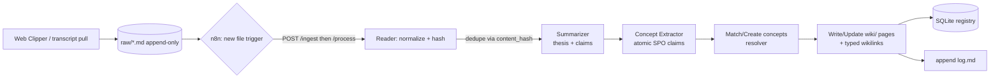
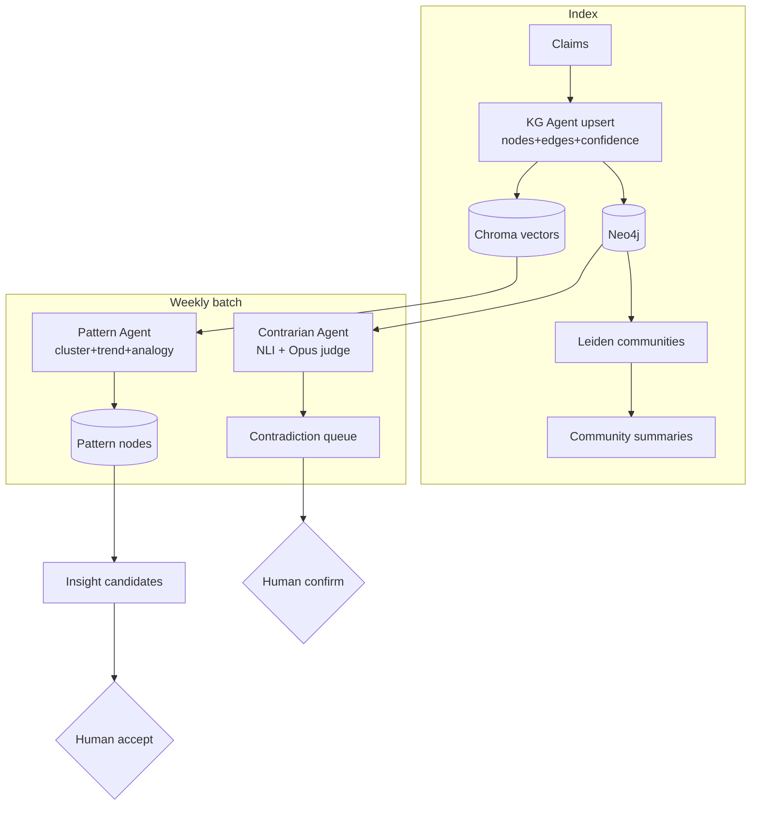
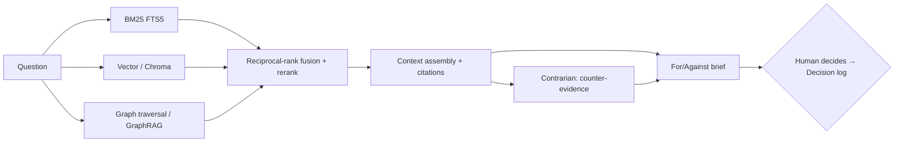
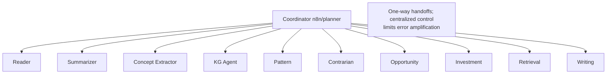

# AI-Assisted PKM System — Technical Specification (Build Blueprint v1.0)

**Status:** Implementation-ready · **Audience:** Engineers building with Claude Code
**Stack:** Obsidian (Markdown) · Python 3.11 · SQLite → Neo4j · Chroma · Claude API · n8n · Docker

This document converts the research synthesis into concrete, buildable specifications. It is organized so that the MVP (Part 10) can be built end-to-end using only Parts 1–3, 5, 8–9; Neo4j/Chroma (Parts 4, 6) are additive and gated behind explicit thresholds.

---

## 0. Architectural decisions (binding)

| # | Decision | Rationale |
|---|----------|-----------|
| AD-1 | **Vault is source of truth; databases are derived indexes.** Markdown in `vault/` can fully rebuild SQLite/Chroma/Neo4j. | File-over-app durability; zero lock-in (Principle 18). |
| AD-2 | **`raw/` is append-only and content-addressed.** Never edited; re-ingest is idempotent. | Provenance + reconstructable history (Principles 10, 21). |
| AD-3 | **Property graph lives in SQLite through V1**, migrates to Neo4j at V2 only. | Avoid premature infrastructure (documented failure mode). |
| AD-4 | **All logic sits behind one Python service (`pkm` CLI + FastAPI).** n8n only triggers and routes. | Testable without n8n; orchestrator is replaceable. |
| AD-5 | **Three-tier entity resolution** (exact → alias → embedding+LLM), never `name+type` alone. | Prevents duplicate `TSMC`/`Taiwan Semiconductor` nodes. |
| AD-6 | **Every claim and edge carries `confidence ∈ [0,1]` + `provenance[]`.** Confidence updates by noisy-OR on independent recurrence. | Principles 10, 11; MedKGent update rule. |
| AD-7 | **Model tiering:** Haiku = cleanup/extraction; Sonnet = summarize/concept/graph; Opus = synthesis/contrarian/writing. | Cost control; reserve reasoning budget for judgment steps. |
| AD-8 | **Human-in-the-loop gates** at: insight acceptance, decision logging, contradiction confirmation, edge pruning. | Anti-de-skilling (Principle 16). |

---

## 1. Repository Structure

```
pkm-system/
├── vault/                          # AD-1: Obsidian vault = source of truth
│   ├── raw/                        # AD-2: append-only captures
│   │   └── 2026/06/                # year/month partitioning
│   │       └── 20260614T0930Z__stratechery__ai-integration__a1b2c3.md
│   ├── wiki/                       # AI-maintained synthesized layer
│   │   ├── concepts/               # evergreen concept pages
│   │   ├── sources/                # one page per ingested source
│   │   ├── entities/
│   │   │   ├── companies/
│   │   │   ├── authors/
│   │   │   └── industries/
│   │   ├── models/                 # mental models / frameworks
│   │   ├── patterns/
│   │   ├── insights/
│   │   ├── hypotheses/
│   │   ├── opportunities/
│   │   ├── theses/                 # investment theses
│   │   ├── decisions/              # decision logs
│   │   └── outcomes/
│   ├── SCHEMA.md                   # ontology + page rules (Karpathy layer 3)
│   ├── index.md                    # catalog (regenerated)
│   └── log.md                      # append-only timeline
│
├── engine/                         # AD-4: the Python service
│   ├── pyproject.toml
│   ├── pkm/
│   │   ├── __init__.py
│   │   ├── cli.py                  # `pkm ingest|search|lint|rebuild|graph`
│   │   ├── config.py               # pydantic-settings, reads .env
│   │   ├── schemas/                # pydantic models (the contracts)
│   │   │   ├── source.py
│   │   │   ├── claim.py
│   │   │   ├── concept.py
│   │   │   ├── entity.py
│   │   │   ├── graph.py            # node/edge models
│   │   │   └── agent_io.py         # per-agent input/output schemas
│   │   ├── store/                  # storage adapters (swappable)
│   │   │   ├── sqlite_store.py     # MVP + V1 (incl. graph tables)
│   │   │   ├── chroma_store.py     # V1+
│   │   │   ├── neo4j_store.py      # V2+
│   │   │   └── vault.py            # read/write Markdown + front matter
│   │   ├── ingest/
│   │   │   ├── reader.py           # HTML/PDF/transcript → clean Markdown
│   │   │   ├── chunker.py          # TextUnit chunking (1200 tok default)
│   │   │   ├── hashing.py          # content-addressed IDs
│   │   │   └── pipeline.py         # orchestrates ingest stages
│   │   ├── agents/
│   │   │   ├── base.py             # Agent ABC: role/prompt/io schema/model
│   │   │   ├── reader_agent.py
│   │   │   ├── summarizer_agent.py
│   │   │   ├── concept_extractor.py
│   │   │   ├── kg_agent.py
│   │   │   ├── pattern_agent.py    # V2
│   │   │   ├── contrarian_agent.py # V2
│   │   │   ├── opportunity_agent.py# V3
│   │   │   ├── investment_agent.py # V3
│   │   │   ├── retrieval_agent.py
│   │   │   └── writing_agent.py    # V3
│   │   ├── graph/
│   │   │   ├── resolver.py         # AD-5 entity resolution
│   │   │   ├── confidence.py       # AD-6 noisy-OR updates
│   │   │   ├── graphrag.py         # Leiden communities + summaries (V2)
│   │   │   └── queries.py          # Cypher / SQL graph queries
│   │   ├── retrieval/
│   │   │   ├── hybrid.py           # BM25 + vector + graph fusion
│   │   │   └── rerank.py
│   │   ├── prompts/                # versioned .md prompt templates
│   │   │   ├── summarize.v1.md
│   │   │   ├── extract_claims.v1.md
│   │   │   ├── er_extraction.v1.md
│   │   │   └── ...
│   │   ├── llm/
│   │   │   ├── client.py           # Claude API wrapper, retries, JSON mode
│   │   │   └── models.py           # model-string constants + tiering
│   │   └── api/
│   │       ├── app.py              # FastAPI app factory
│   │       └── routes/             # ingest, search, graph, notes, jobs
│   └── tests/
│       ├── fixtures/               # sample raw files + golden outputs
│       ├── test_ingest.py
│       ├── test_resolver.py
│       └── test_idempotency.py
│
├── n8n/                            # exported workflow JSON (versioned)
│   ├── 01_ingest_on_new_raw.json
│   ├── 02_nightly_lint.json
│   └── 03_weekly_patterns.json     # V2
│
├── migrations/
│   ├── sqlite/001_init.sql
│   ├── sqlite/002_graph_tables.sql
│   └── neo4j/001_constraints.cypher
│
├── config/
│   ├── SCHEMA.md -> ../vault/SCHEMA.md   # symlink; schema-as-code
│   └── context_profile.yaml        # user's manufacturing/portfolio context (V3)
│
├── docker-compose.yml              # neo4j, chroma, n8n, engine
├── .env.example
└── README.md
```

**Boundary rule:** n8n nodes never contain business logic. They call `POST /ingest`, `POST /jobs/lint`, etc., or shell out to `pkm <command>`. This keeps the system fully runnable and testable from the CLI.

---

## 2. Database Schema (SQLite — MVP & V1)

SQLite is the metadata registry and, through V1, also holds the property graph (AD-3). DDL below is `migrations/sqlite/001_init.sql` + `002_graph_tables.sql`.

### 2.1 Core registry (`001_init.sql`)

```sql
PRAGMA journal_mode = WAL;
PRAGMA foreign_keys = ON;

-- One row per ingested source artifact.
CREATE TABLE sources (
    id            TEXT PRIMARY KEY,          -- src_<sha256[:12]> (AD-2)
    content_hash  TEXT NOT NULL UNIQUE,      -- sha256 of normalized text
    type          TEXT NOT NULL CHECK (type IN
                    ('Article','Book','Paper','Newsletter','Podcast','Meeting','Note')),
    title         TEXT,
    author        TEXT,
    url           TEXT,
    publisher     TEXT,
    date_published TEXT,                      -- ISO-8601
    date_saved    TEXT NOT NULL,             -- ISO-8601 UTC
    raw_path      TEXT NOT NULL,             -- vault-relative path
    wiki_path     TEXT,                      -- source page path once created
    credibility   REAL DEFAULT 0.5,          -- 0..1
    tags          TEXT,                       -- JSON array
    status        TEXT NOT NULL DEFAULT 'captured'
                    CHECK (status IN
                    ('captured','summarized','extracted','linked','done','error')),
    created_at    TEXT NOT NULL,
    updated_at    TEXT NOT NULL
);
CREATE INDEX idx_sources_status ON sources(status);
CREATE INDEX idx_sources_type   ON sources(type);

-- TextUnits: deterministic chunks of a source (provenance spans live here).
CREATE TABLE chunks (
    id          TEXT PRIMARY KEY,            -- chk_<source>_<ordinal>
    source_id   TEXT NOT NULL REFERENCES sources(id) ON DELETE CASCADE,
    ordinal     INTEGER NOT NULL,
    char_start  INTEGER NOT NULL,            -- offset into raw text
    char_end    INTEGER NOT NULL,
    token_count INTEGER,
    text        TEXT NOT NULL,
    UNIQUE (source_id, ordinal)
);
CREATE INDEX idx_chunks_source ON chunks(source_id);

-- Structured summaries (1:1 with source).
CREATE TABLE summaries (
    source_id   TEXT PRIMARY KEY REFERENCES sources(id) ON DELETE CASCADE,
    thesis      TEXT,
    body        TEXT NOT NULL,               -- markdown
    model       TEXT NOT NULL,
    confidence  REAL NOT NULL DEFAULT 0.5,
    created_at  TEXT NOT NULL
);

-- Atomic claims (the idea unit). Subject-predicate-object where possible.
CREATE TABLE claims (
    id          TEXT PRIMARY KEY,            -- clm_<uuid7>
    source_id   TEXT NOT NULL REFERENCES sources(id) ON DELETE CASCADE,
    chunk_id    TEXT REFERENCES chunks(id),  -- provenance span (AD-6)
    statement   TEXT NOT NULL,
    subject     TEXT, predicate TEXT, object TEXT,
    claim_type  TEXT CHECK (claim_type IN
                    ('fact','opinion','prediction','definition','causal','statistic')),
    confidence  REAL NOT NULL DEFAULT 0.5,
    status      TEXT NOT NULL DEFAULT 'candidate'
                    CHECK (status IN ('candidate','approved','merged','rejected')),
    valid_from  TEXT, valid_to TEXT,         -- temporal validity
    created_at  TEXT NOT NULL
);
CREATE INDEX idx_claims_source ON claims(source_id);

-- Concepts (evergreen pages, canonical).
CREATE TABLE concepts (
    id          TEXT PRIMARY KEY,            -- cpt_<slug>
    name        TEXT NOT NULL,
    definition  TEXT,
    domain      TEXT,
    wiki_path   TEXT NOT NULL,
    created_at  TEXT NOT NULL,
    updated_at  TEXT NOT NULL
);
CREATE TABLE concept_aliases (                -- AD-5 alias resolution tier 2
    alias       TEXT NOT NULL,
    concept_id  TEXT NOT NULL REFERENCES concepts(id) ON DELETE CASCADE,
    PRIMARY KEY (alias, concept_id)
);
CREATE TABLE claim_concepts (                 -- many-to-many
    claim_id    TEXT REFERENCES claims(id) ON DELETE CASCADE,
    concept_id  TEXT REFERENCES concepts(id) ON DELETE CASCADE,
    PRIMARY KEY (claim_id, concept_id)
);

-- Entities (companies/authors/industries/etc.) — generic typed table.
CREATE TABLE entities (
    id          TEXT PRIMARY KEY,            -- ent_<type>_<slug>
    type        TEXT NOT NULL,               -- Company|Author|Industry|...
    name        TEXT NOT NULL,
    properties  TEXT,                         -- JSON (ticker, affiliation, ...)
    wiki_path   TEXT,
    created_at  TEXT NOT NULL,
    updated_at  TEXT NOT NULL,
    UNIQUE (type, name)
);
CREATE TABLE entity_aliases (
    alias       TEXT NOT NULL,
    entity_id   TEXT NOT NULL REFERENCES entities(id) ON DELETE CASCADE,
    PRIMARY KEY (alias, entity_id)
);

-- Idempotency + observability for every agent invocation.
CREATE TABLE agent_runs (
    id          TEXT PRIMARY KEY,
    agent       TEXT NOT NULL,
    source_id   TEXT,
    input_hash  TEXT NOT NULL,               -- dedupe identical work
    model       TEXT,
    tokens_in   INTEGER, tokens_out INTEGER,
    cost_usd    REAL,
    status      TEXT NOT NULL,               -- ok|error
    error       TEXT,
    started_at  TEXT NOT NULL, finished_at TEXT,
    UNIQUE (agent, input_hash)
);

-- Vector index bookkeeping (Chroma holds vectors; this maps ids).
CREATE TABLE embeddings_meta (
    object_id   TEXT PRIMARY KEY,            -- claim/concept/chunk id
    object_kind TEXT NOT NULL,               -- claim|concept|chunk
    collection  TEXT NOT NULL,               -- chroma collection name
    model       TEXT NOT NULL,
    dim         INTEGER NOT NULL,
    updated_at  TEXT NOT NULL
);

-- FTS5 for BM25 keyword retrieval (MVP-grade search).
CREATE VIRTUAL TABLE claims_fts USING fts5(
    statement, content='claims', content_rowid='rowid'
);
```

### 2.2 Graph tables (`002_graph_tables.sql`, used V1; superseded by Neo4j at V2)

```sql
CREATE TABLE graph_nodes (
    id          TEXT PRIMARY KEY,            -- mirrors entity/concept/etc id
    label       TEXT NOT NULL,               -- Source|Concept|Company|Pattern|...
    name        TEXT NOT NULL,
    properties  TEXT,                         -- JSON
    confidence  REAL DEFAULT 0.5,
    provenance  TEXT,                         -- JSON array of {source_id,chunk_id}
    created_at  TEXT NOT NULL, updated_at TEXT NOT NULL
);
CREATE INDEX idx_nodes_label ON graph_nodes(label);

CREATE TABLE graph_edges (
    id          TEXT PRIMARY KEY,
    src         TEXT NOT NULL REFERENCES graph_nodes(id) ON DELETE CASCADE,
    dst         TEXT NOT NULL REFERENCES graph_nodes(id) ON DELETE CASCADE,
    type        TEXT NOT NULL,               -- SUPPORTS|CONTRADICTS|ABOUT|...
    description TEXT,
    strength    INTEGER CHECK (strength BETWEEN 1 AND 10),
    confidence  REAL DEFAULT 0.5,
    provenance  TEXT,                         -- JSON array
    created_at  TEXT NOT NULL, updated_at TEXT NOT NULL
);
CREATE INDEX idx_edges_src  ON graph_edges(src);
CREATE INDEX idx_edges_dst  ON graph_edges(dst);
CREATE INDEX idx_edges_type ON graph_edges(type);
```

This SQLite graph is a drop-in for the Neo4j model in Part 4 — the same node labels, edge types, and properties — so V2 migration is an ETL, not a redesign.

---

## 3. Markdown Note Schema

### 3.1 Universal front matter (every `wiki/` page)

```yaml
---
id: <typed id>            # cpt_operating-leverage, src_a1b2c3, ...
type: concept             # concept|source|company|author|industry|model|
                          # pattern|insight|hypothesis|opportunity|thesis|decision|outcome
title: "Operating Leverage"
created: 2026-06-14T09:30:00Z
updated: 2026-06-14T09:30:00Z
source_paths: []          # provenance: vault-relative raw/ paths
tags: []
entities:                 # outbound references, by type
  companies: []
  people: []
  concepts: []
confidence: 0.7           # 0..1
status: active            # active|draft|stale|archived
---
```

**Rules (enforced by the linter):** front matter is mandatory; `id` is immutable; `[[wikilinks]]` are the only link form; `## MyThinking` blocks are explicitly tagged and never overwritten by agents; provenance must resolve to a file under `raw/`.

### 3.2 `raw/` capture front matter (append-only)

```yaml
---
id: src_a1b2c3d4e5f6
type: source
source_type: Article      # Article|Book|Paper|Newsletter|Podcast|Meeting
title: "AI Integration"
author: "Ben Thompson"
url: "https://stratechery.com/..."
date_published: 2026-01-15
date_saved: 2026-06-14T09:30:00Z
content_hash: sha256:a1b2c3...
tags: [strategy, ai]
---
<full cleaned markdown body — never edited after write>
```

### 3.3 Template catalog (12 types)

Each template = universal front matter + the type-specific sections below. Headings are contractual: agents read/write by heading.

| Template | Required sections |
|----------|-------------------|
| **Article Note** | `## TL;DR` · `## Key Claims` (atomic, each `^cite:src_x#chk_n`) · `## Evidence & Data` · `## MyThinking` · `## Contradicts / Confirms` · `## Extracted Concepts` · `## Open Questions` |
| **Book Note** | + `## Thesis` · `## Chapter Distillations` · `## Mental Models Present` · `## Most Useful Idea` · `## Disagreements` |
| **Paper Note** | + `## Question/Hypothesis` · `## Method` · `## Findings` · `## Effect Sizes/Limits` · `## Replication/Credibility` · `## Citations to Chase` |
| **Newsletter Note** | + `## Issue/Date` · `## Signal vs Noise` · `## Tickers Mentioned` · `## Trend Updates` |
| **Podcast Note** | + `## Guest & Credibility` · `## Timestamped Key Points` · `## Quotes (verbatim + time)` · `## Follow-ups` |
| **Meeting Note** | + `## Attendees` · `## Decisions → [[decision]]` · `## Action Items (owner/date)` · `## Commitments` · `## Risks Raised` |
| **Concept Note** | `## One-sentence Definition` (API-like) · `## Explanation` · `## Related Concepts` · `## Instances/Evidence` · `## Provenance` |
| **Mental Model Note** | `## Definition` · `## Discipline` · `## When It Applies` · `## Examples in My Domain` · `## Failure Cases` · `## Linked Decisions` |
| **Insight Note** | `## Statement` · `## Supporting Nodes` · `## Confidence & Novelty` · `## So What` · `## Decisions/Opportunities Informed` |
| **Opportunity Note** | `## Opportunity` · `## Underlying Pattern/Insight` · `## Why Now` · `## Fit With Capabilities` · `## Risks/Unknowns` · `## Next Action` |
| **Investment Thesis** | `## Thesis (one line)` · `## Company/Asset` · `## Variant Perception` · `## Key Drivers & KPIs` · `## Valuation` · `## Risks & Disconfirming Evidence` · `## Catalysts` · `## Position & Review Trigger` |
| **Decision Log** | `## Decision & Date` · `## Context` · `## Options` · `## Chosen + Rationale` · `## Confidence (%)` · `## Expected Outcome` · `## State of Mind` · `## Review Date` · `## Outcome (later)` · `## Lessons` |

**Provenance anchor convention:** every atomic claim line ends with `^cite:<source_id>#<chunk_id>` so a claim in `wiki/` always resolves to a char span in `raw/`.

---

## 4. Knowledge Graph Schema (Neo4j — V2)

Labeled property graph. `migrations/neo4j/001_constraints.cypher`.

### 4.1 Node labels & key properties

| Label | Key properties |
|-------|----------------|
| `Source` | id, title, type, author, date, url, hash, raw_path, credibility |
| `Author` | id, name, affiliation, domains, reliability |
| `Company` | id, name, ticker, industry, role, stage |
| `Industry` | id, name, value_chain_position, growth, cyclicality |
| `Concept` | id, name, aliases[], definition, domain |
| `Framework` | id, name, steps, domain |
| `MentalModel` | id, name, discipline, description |
| `Pattern` | id, name, pattern_type, support_count, first_seen, confidence |
| `Event` | id, name, date, type, magnitude |
| `Decision` | id, statement, options, chosen, confidence, review_date |
| `Insight` | id, statement, confidence, novelty, date |
| `Hypothesis` | id, statement, status, confidence |
| `Opportunity` | id, description, type, time_sensitivity, confidence |
| `Project` | id, name, status, goal, deadline |
| `Outcome` | id, description, date, delta_vs_expected |
| `Claim` | id, statement, claim_type, confidence, source_span |

**Common to all nodes:** `id, label, name, created_at, updated_at, confidence, provenance` (provenance = list of `source_id#chunk_id`).

### 4.2 Relationship types

All edges directed, with properties `{type, description, strength:1..10, confidence:0..1, source_span, created_at, updated_at}`.

```
WRITTEN_BY  ABOUT  MENTIONS  SUPPORTS  CONTRADICTS  RELATED_TO  INSTANCE_OF
EXPLAINS  OBSERVED_IN  DERIVED_FROM  INFORMED_BY  RESULTED_IN  TARGETS
COMPETES_WITH  SUPPLIES  OPERATES_IN  AFFECTS  EVIDENCE_FOR  VALIDATES  REFUTES
```

**Pipeline backbone:** `Source → Claim → Concept → Pattern → Insight → Decision → Outcome`.

### 4.3 Constraints & indexes

```cypher
// Uniqueness on id per label
CREATE CONSTRAINT source_id  IF NOT EXISTS FOR (n:Source)   REQUIRE n.id IS UNIQUE;
CREATE CONSTRAINT concept_id IF NOT EXISTS FOR (n:Concept)  REQUIRE n.id IS UNIQUE;
CREATE CONSTRAINT company_id IF NOT EXISTS FOR (n:Company)  REQUIRE n.id IS UNIQUE;
// ... one per label

// Lookup indexes
CREATE INDEX concept_name IF NOT EXISTS FOR (n:Concept) ON (n.name);
CREATE INDEX company_ticker IF NOT EXISTS FOR (n:Company) ON (n.ticker);
CREATE FULLTEXT INDEX claim_ft IF NOT EXISTS FOR (n:Claim) ON EACH [n.statement];
```

### 4.4 Confidence update (noisy-OR, AD-6)

When independent evidence recurs: `s' = 1 − (1 − s_old)·(1 − s_new)`. Implemented in `graph/confidence.py`; applied on every edge/claim upsert where provenance adds a *new* source.

### 4.5 Temporal & contradiction policy

Never overwrite a contradicted claim — set `valid_to`, create the new claim, and add a `CONTRADICTS` edge with provenance. Conflicting edge types are resolved by an Opus call at `temperature=0` weighing confidence + recency, and flagged to the human queue.

### 4.6 GraphRAG layer

Index step: extract entities/relationships/claims per TextUnit (1200 tok) → detect communities via **hierarchical Leiden** → generate **bottom-up community summaries** → store on `(:Community {id, level, summary})` nodes. Query step: **local** (entity-anchored neighborhood) and **global** (map-reduce over community summaries) modes in `graph/graphrag.py`.

---

## 5. API Design

FastAPI service (`engine/pkm/api`). All endpoints return `{data, meta}`; errors use RFC-7807 problem+json. Auth: single API key header for local/self-host.

### 5.1 Endpoints

```
POST   /v1/ingest                 # enqueue/normalize a source
  body: {url?|text?|file_b64?, source_type, hints?}
  201 → {source_id, raw_path, status, deduped:bool}

GET    /v1/sources/{id}            → source record + status
GET    /v1/sources?status=&type=  → paginated list

POST   /v1/sources/{id}/process    # run summarize→extract→link→wiki
  202 → {job_id}

GET    /v1/search                  # hybrid retrieval (Part 6 / retrieval agent)
  query: q, k=10, mode=hybrid|vector|bm25|graph, filters{type,entity,date}
  200 → {results:[{object_id,kind,score,snippet,citations[]}]}

POST   /v1/graph/query             # Cypher (V2) or SQL graph (V1)
  body: {question} | {cypher}
  200 → {nodes[], edges[], answer?, citations[]}

GET    /v1/insights?status=candidate          → review queue
POST   /v1/insights/{id}/accept|reject        # HITL gate (AD-8)

GET    /v1/contradictions?status=open         → contradiction queue (V2)
POST   /v1/contradictions/{id}/confirm|dismiss

POST   /v1/decisions                          # create decision log
PATCH  /v1/decisions/{id}/outcome             # close the loop

POST   /v1/jobs/lint                          # broken links, orphans, missing provenance
POST   /v1/jobs/patterns                       # V2 batch pattern detection
POST   /v1/jobs/rebuild                        # rebuild indexes from vault (AD-1)

GET    /v1/dashboard                           # outputs produced, queues, stale notes
```

### 5.2 Claude API usage pattern (in `llm/client.py`)

- **Structured output enforced** via tool/function-calling with a strict JSON schema per agent (Part 6). Reject + one repair-retry on schema-invalid output.
- **Idempotency:** hash `(agent, prompt_version, input)`; skip if `agent_runs` has a matching `ok` row.
- **Model strings:** `claude-haiku-4-5-20251001` (cleanup/extract), `claude-sonnet-4-6` (summarize/concept/graph), `claude-opus-4-8` (synthesis/contrarian/writing). Centralized in `llm/models.py`.
- **Cost/observability:** every call writes tokens + cost to `agent_runs`.

---

## 6. Agent Design

Base contract (`agents/base.py`): each agent declares `role`, `model`, `prompt_template (versioned)`, `input_schema`, `output_schema (pydantic)`, `memory_tier`, `tools`. Prompt skeleton for all: **role → task → input schema → output schema → constraints → 1 few-shot example.** Output is validated against the pydantic schema before persistence.

| # | Agent | Model | Input → Output | Memory | Version |
|---|-------|-------|----------------|--------|---------|
| 1 | **Reader** | Haiku | raw bytes/URL → clean `raw/*.md` + front matter | stateless (hash dedupe) | MVP |
| 2 | **Summarizer** | Sonnet | raw note → `{thesis, key_claims[], caveats[]}` w/ spans | working (current doc) | MVP |
| 3 | **Concept Extractor** | Sonnet | summary → `{claims[], concept_matches[]}` (SPO) | reads concept index | MVP |
| 4 | **KG Agent** | Sonnet | claims → `{nodes[], relationships[]}` upserts | graph schema + entity index | V1→V2 |
| 5 | **Pattern Detection** | Sonnet | graph/embeddings → `Pattern` nodes | long (historical counts) | V2 |
| 6 | **Contrarian** | Opus | claim/thesis → `{contradictions[], steelman}` | reads related claims | V2 |
| 7 | **Opportunity** | Opus | patterns + profile → `Opportunity` notes | context profile + graph | V3 |
| 8 | **Investment Research** | Opus | company/industry query → thesis + evidence | portfolio context + events | V3 |
| 9 | **Retrieval** | Sonnet | question → ranked context + citations | indices | MVP→V2 |
| 10 | **Writing** | Opus | brief + retrieved context → draft w/ citations | style guide + notes | V3 |

### 6.1 Example I/O schemas (pydantic, `schemas/agent_io.py`)

```python
class KeyClaim(BaseModel):
    statement: str
    subject: str | None; predicate: str | None; object: str | None
    claim_type: Literal["fact","opinion","prediction","definition","causal","statistic"]
    chunk_id: str                       # provenance (required)
    confidence: float = Field(ge=0, le=1)

class SummarizerOutput(BaseModel):
    thesis: str
    key_claims: list[KeyClaim]
    caveats: list[str]
    summary_confidence: float = Field(ge=0, le=1)

class GraphNode(BaseModel):
    id: str; label: str; name: str
    properties: dict = {}
    confidence: float = Field(ge=0, le=1)
    provenance: list[str]               # ["src_x#chk_3", ...]

class GraphRelationship(BaseModel):
    src: str; dst: str
    type: str; description: str
    strength: int = Field(ge=1, le=10)
    confidence: float = Field(ge=0, le=1)
    provenance: list[str]

class KGAgentOutput(BaseModel):
    nodes: list[GraphNode]
    relationships: list[GraphRelationship]
```

### 6.2 Entity resolution (AD-5, `graph/resolver.py`)

```
resolve(name, type):
  1. exact match on entities(type, name)            → return id
  2. alias match on entity_aliases                  → return id
  3. embedding top-k same-type candidates (cosine ≥ 0.88)
       → Opus confirm "same real-world entity?" (temp 0)
       → if yes: add alias, return id ; else: create new node
```

---

## 7. Workflow Diagrams

### 7.1 MVP ingest pipeline



### 7.2 V2 graph + pattern + contradiction



### 7.3 Retrieval / decision support



### 7.4 Agent orchestration (coordinator, V3)



---

## 8. File Naming Conventions

### 8.1 `raw/` (content-addressed, sortable)

```
raw/<YYYY>/<MM>/<UTC-timestamp>__<source-slug>__<title-slug>__<hash6>.md
e.g. raw/2026/06/20260614T0930Z__stratechery__ai-integration__a1b2c3.md
```
- Timestamp `YYYYMMDDThhmmZ`; slugs `[a-z0-9-]`, truncated to 40 chars.
- `hash6` = first 6 of content sha256 → guarantees uniqueness + idempotency.

### 8.2 `wiki/` (human-readable, by type)

```
wiki/concepts/operating-leverage.md
wiki/sources/2026-stratechery-ai-integration.md
wiki/entities/companies/tsmc.md
wiki/insights/2026-06-lead-time-compression-moat.md
wiki/decisions/2026-06-14-add-second-cnc-line.md
```
Slug = canonical name; date-prefix for time-bound types (insights, decisions, outcomes, opportunities).

### 8.3 IDs (stable, typed)

| Object | Pattern | Example |
|--------|---------|---------|
| Source | `src_<hash12>` | `src_a1b2c3d4e5f6` |
| Chunk | `chk_<src>_<ord>` | `chk_a1b2c3_007` |
| Claim | `clm_<uuid7>` | `clm_018f...` |
| Concept | `cpt_<slug>` | `cpt_operating-leverage` |
| Entity | `ent_<type>_<slug>` | `ent_company_tsmc` |
| Pattern/Insight/etc. | `<3-letter>_<uuid7>` | `pat_018f...`, `ins_018f...` |

IDs are immutable once assigned (AD-1). Renaming a page changes `title`/path, never `id`.

---

## 9. Metadata Standards

1. **Timestamps:** ISO-8601 UTC with `Z`. Two fields everywhere: `created`, `updated`.
2. **Confidence:** float `[0,1]` on claims, edges, summaries, insights. Seeded by extractor (default 0.5), raised by noisy-OR on independent recurrence, set to ≥0.9 on human confirmation.
3. **Provenance (mandatory):** every claim/edge stores `provenance: ["<source_id>#<chunk_id>", ...]`; wiki claims carry `^cite:` anchors. A claim with no resolvable provenance fails the linter.
4. **Relationship strength:** integer `1–10` from the extraction prompt; reinforced on recurrence.
5. **Status enums:** sources `captured→summarized→extracted→linked→done|error`; claims `candidate→approved|merged|rejected`; notes `active|draft|stale|archived`.
6. **Credibility:** per-source `0–1`, used to weight confidence and rank evidence.
7. **Tags:** lowercase kebab; controlled vocabulary maintained in `SCHEMA.md`.
8. **Entity references:** front matter `entities.{companies,people,concepts}` mirror `[[wikilinks]]`; linter enforces consistency.
9. **Schema-as-code:** `SCHEMA.md` is versioned; a `schema_version` field in `index.md` gates migrations.
10. **Dashboard metrics (success = output, not input):** insights accepted, decisions logged, theses/drafts produced, contradiction queue depth, orphan/stale counts. Note count is *not* a success metric.

---

## 10. MVP Implementation Plan

**Goal:** the Karpathy LLM-Wiki loop, end to end, answering real questions within days. No Neo4j, no Chroma, no vector DB (long-context retrieval). Scope = AD-1, AD-2, AD-4, AD-6, AD-7 + Parts 1–3, 5 (subset), 6 (agents 1–3, 9), 8, 9.

### Milestones

**M0 — Scaffold (0.5 day).** Create repo per Part 1; `pyproject.toml`; `docker-compose` with just `engine` + `n8n`; `.env` (Anthropic key, vault path); run `migrations/sqlite/001_init.sql`. *Done when* `pkm --help` runs and the empty vault + DB exist.

**M1 — Vault + schema (0.5 day).** Author `SCHEMA.md` (ontology, page rules, tag vocab), `index.md`, empty `log.md`, all `wiki/` subfolders, the 12 templates as `_templates/*.md`. *Done when* an Obsidian vault opens cleanly and templates resolve.

**M2 — Reader + capture (1 day).** `ingest/reader.py` (HTML→MD via readability/trafilatura, PDF text, YouTube/podcast transcript pull), `hashing.py`, `chunker.py` (1200-tok TextUnits). `POST /v1/ingest` writes content-addressed `raw/` file + `sources`/`chunks` rows; dedupe by `content_hash`. *Done when* re-ingesting the same URL is a no-op (idempotency test green).

**M3 — Summarizer + Concept Extractor (1.5 days).** Agents 2 and 3 with versioned prompts and pydantic-validated JSON output; persist `summaries`, `claims`, `concepts`, `concept_aliases`, `claim_concepts`; write/update `wiki/sources/*.md` and `wiki/concepts/*.md` with `[[wikilinks]]` and `^cite:` anchors; append `log.md`. Three-tier resolver (exact+alias only at MVP; embedding tier stubbed). *Done when* one article flows clip→raw→summary→atomic claims→concept pages with provenance.

**M4 — Retrieval (1 day).** FTS5 BM25 over `claims_fts` + long-context assembly: `GET /v1/search` returns ranked claims with citations; `POST /v1/graph/query` answers via Claude over selected wiki pages. *Done when* a natural-language question returns a cited answer.

**M5 — n8n + lint + dashboard (1 day).** `01_ingest_on_new_raw.json` (watch `raw/` → `/ingest`+`/process`); `02_nightly_lint.json` → `POST /jobs/lint` (broken links, orphans, missing provenance); minimal `GET /dashboard` (outputs produced, orphan/stale counts). *Done when* dropping a file in `raw/` auto-produces wiki pages and the nightly lint reports cleanly.

**Total: ~6 working days.** Acceptance for MVP exit: (a) idempotent ingest; (b) every wiki claim resolves to a `raw/` span; (c) weekly query habit possible; (d) dashboard tracks outputs, not note count.

### Advancement gates (when to build V1/V2/V3)

| Trigger | Build |
|---------|-------|
| Corpus ≳150 sources **or** long-context misses answers | **V1:** Chroma embeddings, 12 templates wired, nightly lint hardening, Retrieval agent hybrid (BM25+vector) |
| Relational / multi-hop / "what's changing" questions recur | **V2:** Neo4j (ETL from `graph_*` tables), GraphRAG (Leiden + community summaries), Pattern + Contrarian agents, contradiction & trend dashboards |
| You want active opportunity/thesis generation | **V3:** Opportunity + Investment + Writing agents wired to `context_profile.yaml`, coordinator orchestration, decision→outcome loop closure |

### Test strategy
- `test_idempotency.py`: same input twice → one source, one agent_run.
- `test_resolver.py`: TSMC / "Taiwan Semiconductor" → one entity.
- `test_ingest.py`: golden-file comparison on fixtures.
- Schema-validation tests on every agent output (reject + one repair retry).

### Risk controls (from the blueprint's failure modes)
Freeze toolset ≥6 months · cap infra time (MVP is deliberately minimal) · contradiction output is a *review queue*, never ground truth · scheduled pruning + spaced resurfacing against note graveyards · human gates on insight/decision/edge acceptance against de-skilling.

---

*End of specification. Build order: Part 10 milestones M0→M5, using Parts 1–3, 5, 8–9 as reference; defer Parts 4 and 6 (agents 4–10) to the V1/V2/V3 gates.*
