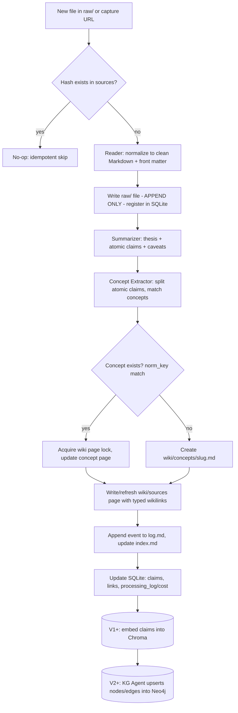
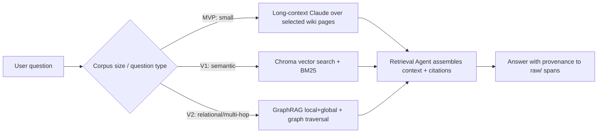
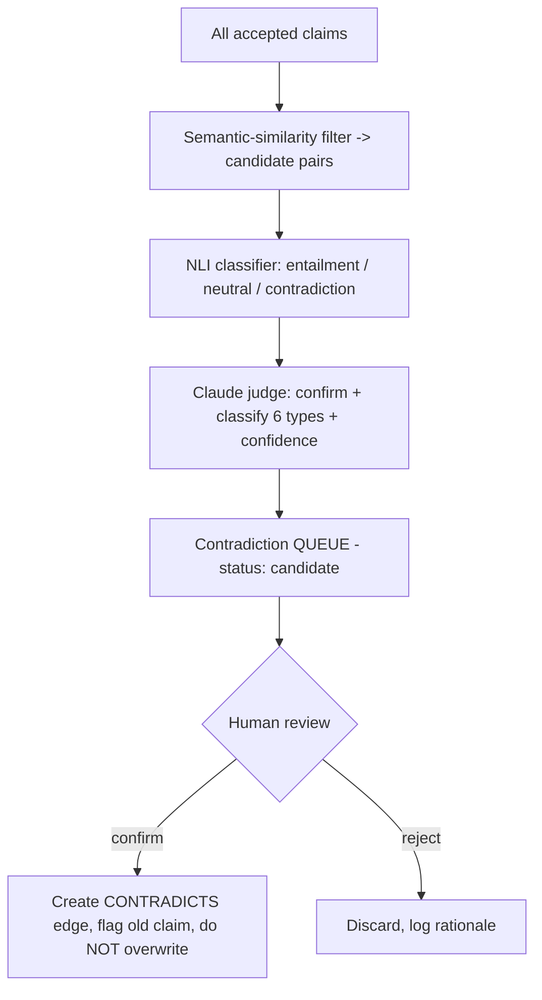
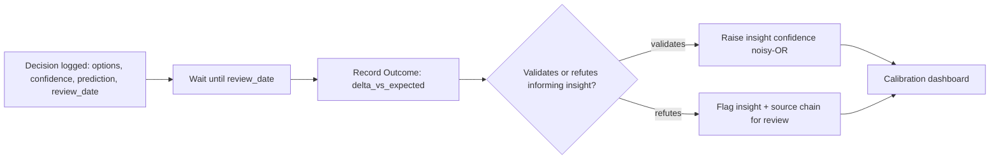
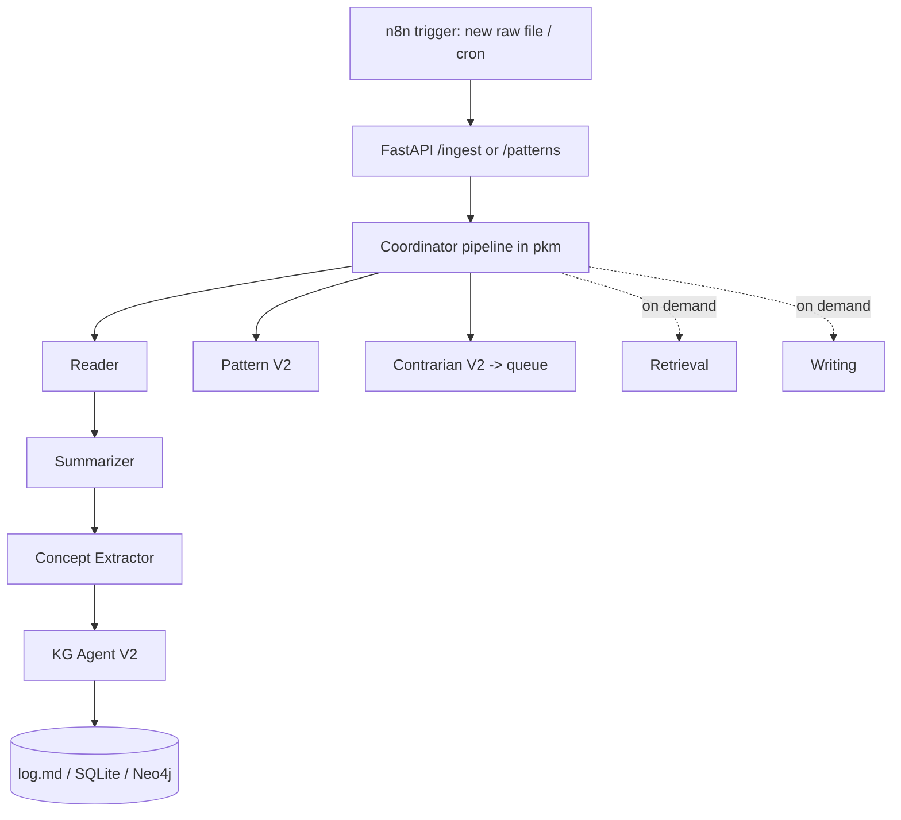

# AI-Assisted PKM — Technical Build Specification

**Role of this document:** Lead-architect translation of *AI-Assisted Personal Knowledge Management: Research Synthesis & Build Blueprint* into an implementable spec. A software engineer (or Claude Code) should be able to start coding from this without re-deriving decisions.

**Stack (fixed):** Python 3.11+, Anthropic Claude API, Obsidian vault (Markdown), SQLite, n8n. Deferred: ChromaDB (V1), Neo4j + GraphRAG + NLI model (V2), market-data feeds (V3).

**Conventions in this doc:** `MUST`/`SHOULD`/`MAY` are normative. Code blocks are starting implementations, not pseudocode. All IDs, paths, and schema fields are authoritative — match them exactly.

---

## 0. Critical Analysis & Architectural Decisions

### 0.1 Verdict on the blueprint

The blueprint is sound and internally consistent, and I'm building to it. Its central engineering bet is correct: **the failure mode is human (Collector's Fallacy, tool-hopping, productivity theater), so the system's primary job is to automate the processing step and measure output, not storage.** The staged MVP→V1→V2→V3 path is disciplined — it defers the expensive infrastructure (Neo4j, GraphRAG, NLI, multi-agent) until the cheap version proves the habit. I'm preserving that staging without compromise.

Where the blueprint is strong I won't restate it. Where it is **underspecified or in tension**, I make the following binding decisions as architect:

### 0.2 Binding decisions (these resolve gaps in the blueprint)

**D1 — Markdown is the single source of truth; SQLite and Neo4j are derived, rebuildable indices.**
The blueprint says "file over app" but never states the rebuild guarantee. I make it explicit and load-bearing: `raw/` + `wiki/` Markdown is the *only* authoritative store. SQLite (V0+) and Neo4j/Chroma (V1+) are **caches** that MUST be reconstructable by `pkm rebuild` from the vault alone. This means: every fact in a database also lives in a Markdown file's front matter or body, and losing the databases loses zero knowledge. This is what makes the system survive 5+ years and any tool's death.

**D2 — Content addressing for idempotency.**
A `raw/` file's identity is `sha256(normalized_content)`. Re-ingesting the same source is a no-op. This makes the whole pipeline safely re-runnable (the blueprint's principle 21, made concrete).

**D3 — Entity resolution key = `(normalized_name, type)`.**
`normalized_name` = lowercased, trimmed, punctuation-stripped, alias-resolved. Merge-on-write (Neo4j `MERGE`, SQLite upsert). No probabilistic dedup in V0–V2; it's a documented failure source and the corpus is solo-scale.

**D4 — Division of labor between n8n, Python, and Claude.**
- **n8n** = orchestration only (triggers, scheduling, HTTP calls, retries, fan-out). No business logic.
- **Python (`pkm` package)** = all logic, file I/O, DB writes, prompt assembly, schema validation. Exposed as a CLI *and* a thin FastAPI service so n8n can call it over HTTP.
- **Claude** = extraction, summarization, classification, synthesis, judging — invoked only from inside `pkm`, always with structured output and a strict output schema.
This keeps logic testable and version-controlled instead of trapped in n8n's visual editor.

**D5 — Confidence is a float in `[0,1]`; relationship strength is an int in `[1,10]`.**
Adopted from GraphRAG. Confidence updates use noisy-OR on independent recurrence: `s' = 1 − (1 − s)·(1 − s_new)`. Human confirmation sets confidence to a floor of `0.95` (not `1.0` — we never claim certainty).

**D6 — The MVP ships with NO vector DB and NO graph DB.** Long-context Claude over selected `wiki/` pages only. This is non-negotiable; premature infrastructure is the documented "productivity theater" failure.

### 0.3 Risks I'm flagging to the owner

- **Ambition vs. anti-theater tension.** V3 (10 agents, Neo4j, GraphRAG, NLI, n8n coordinator) is a large surface to maintain solo. The blueprint's "freeze tools ≥6 months / cap complexity" rule must be enforced *against this very spec*. **Gate V2/V3 on output metrics** (Section 10.6), not on curiosity.
- **Contradiction detection is unreliable** (ContraDoc; GPT-4-class models fail on subtle cross-document cases). The Contrarian agent's output is a **review queue**, never an autowrite. Enforced in the schema via `status: candidate`.
- **Embedding/LLM cost** isn't addressed in the blueprint. I add a `processing_log` cost ledger (Section 2) so spend is observable from day one.
- **Concurrency.** `raw/` is append-only and content-addressed, so ingestion is safe to parallelize. `wiki/` page updates MUST be serialized per-page (file lock) to avoid lost writes when two sources touch the same concept. Specified in Section 5.4.

---

## 1. Repository Structure

Two git repositories. **Code and knowledge are separated** so the vault survives independently of the tooling (D1).

### 1.1 Code repo: `pkm-engine`

```
pkm-engine/
├── pyproject.toml                # deps, build, ruff/black/pytest config
├── README.md
├── .env.example                  # VAULT_PATH, ANTHROPIC_API_KEY, DB paths, model ids
├── config/
│   ├── config.yaml               # non-secret runtime config (models, thresholds)
│   └── prompts/                  # versioned prompt templates (one file per agent)
│       ├── reader.md
│       ├── summarizer.md
│       ├── concept_extractor.md
│       ├── kg_agent.md
│       ├── pattern.md
│       ├── contrarian.md
│       ├── opportunity.md
│       ├── investment.md
│       ├── retrieval.md
│       └── writing.md
├── pkm/                          # the package — all logic lives here
│   ├── __init__.py
│   ├── settings.py               # pydantic-settings: loads .env + config.yaml
│   ├── models/                   # pydantic I/O contracts (the API of the system)
│   │   ├── source.py
│   │   ├── claim.py
│   │   ├── concept.py
│   │   ├── graph.py              # Node/Edge models
│   │   └── agent_io.py           # per-agent Input/Output models
│   ├── store/
│   │   ├── vault.py              # read/write/lock Markdown, front-matter parsing
│   │   ├── sqlite.py             # source registry + derived indices (V0+)
│   │   ├── vectors.py            # Chroma wrapper (V1+, import-guarded)
│   │   └── graph_store.py        # Neo4j driver + Cypher (V2+, import-guarded)
│   ├── llm/
│   │   ├── client.py             # Anthropic client, retries, cost accounting
│   │   └── structured.py         # tool-use/JSON schema enforcement helper
│   ├── agents/                   # one module per agent; uniform Agent.run()
│   │   ├── base.py               # Agent ABC: run(input)->output, prompt loading
│   │   ├── reader.py
│   │   ├── summarizer.py
│   │   ├── concept_extractor.py
│   │   ├── kg_agent.py           # V2+
│   │   ├── pattern.py            # V2+
│   │   ├── contrarian.py         # V2+
│   │   ├── opportunity.py        # V3
│   │   ├── investment.py         # V3
│   │   ├── retrieval.py
│   │   └── writing.py
│   ├── pipelines/
│   │   ├── ingest.py             # raw -> summarize -> extract -> wiki update
│   │   ├── rebuild.py            # vault -> SQLite/Chroma/Neo4j (D1 guarantee)
│   │   ├── lint.py               # broken links, orphans, missing provenance
│   │   ├── patterns.py           # V2 scheduled batch
│   │   └── resurface.py          # V3 spaced repetition / stale check
│   ├── api/
│   │   ├── cli.py                # `pkm ...` Typer CLI
│   │   └── service.py            # FastAPI app for n8n HTTP calls
│   └── migrations/               # SQLite schema migrations, numbered
│       ├── 0001_init.sql
│       ├── 0002_outputs.sql
│       └── ...
├── n8n/
│   └── workflows/                # exported n8n JSON (version-controlled)
│       ├── ingest_on_new_raw.json
│       └── nightly_lint.json
└── tests/
    ├── fixtures/                 # sample raw/ files, expected outputs
    ├── test_vault.py
    ├── test_ingest.py
    ├── test_rebuild.py
    └── test_agents/              # golden-file tests per agent (mocked LLM)
```

### 1.2 Knowledge repo: `knowledge-vault` (the Obsidian vault)

```
knowledge-vault/
├── SCHEMA.md            # ontology + page rules + ingestion rules (Karpathy layer 3)
├── index.md            # human-navigable catalog (auto-maintained)
├── log.md              # append-only event timeline (auto-appended, never edited)
├── raw/                # APPEND-ONLY, immutable. System of record for sources.
│   └── 2026-06-14--stratechery-ai-integration--a1b2c3d4.md
├── wiki/               # AI-maintained synthesis layer
│   ├── sources/        # one page per source (links TO concepts)
│   ├── concepts/       # evergreen concept pages (the atomic unit)
│   ├── models/         # mental models
│   ├── frameworks/
│   ├── companies/
│   ├── industries/
│   ├── patterns/       # V2+
│   ├── insights/
│   ├── hypotheses/
│   ├── opportunities/  # V3
│   ├── theses/         # investment theses, V3
│   └── decisions/      # decision logs
├── context/
│   └── profile.md      # owner's manufacturing/portfolio context (feeds V3 agents)
└── .obsidian/          # Obsidian config (committed for portability)
```

**Why two repos:** the vault has no code dependency and can be opened, edited, backed up, and survived independently. `pkm-engine` points at it via `VAULT_PATH`. Either can be cloned without the other.

---

## 2. Database Schema (SQLite — V0 onward)

SQLite is a **derived index and operational ledger**, never the source of truth (D1). It exists for fast lookups (dedup, dashboard, link registry) and to track processing/cost. Everything here is reconstructable from the vault except the cost ledger (`processing_log`), which is operational history and `MAY` be lost.

File: `knowledge-vault/../pkm.db` (path configurable; default `data/pkm.db` in code repo, **gitignored**).

### 2.1 DDL — `migrations/0001_init.sql`

```sql
PRAGMA journal_mode = WAL;
PRAGMA foreign_keys = ON;

CREATE TABLE schema_migrations (
    version     INTEGER PRIMARY KEY,
    applied_at  TEXT NOT NULL DEFAULT (datetime('now'))
);

-- Source registry. id is content-addressed (D2): 'src_' || substr(sha256,1,16)
CREATE TABLE sources (
    id                TEXT PRIMARY KEY,            -- src_a1b2c3d4e5f6g7h8
    hash              TEXT NOT NULL UNIQUE,        -- full sha256 of normalized content
    title             TEXT NOT NULL,
    type              TEXT NOT NULL CHECK (type IN
                        ('article','book','paper','newsletter','podcast','meeting')),
    author            TEXT,
    url               TEXT,
    date_published    TEXT,                        -- ISO 8601
    date_saved        TEXT NOT NULL DEFAULT (datetime('now')),
    raw_path          TEXT NOT NULL,               -- relative to VAULT_PATH
    wiki_path         TEXT,                        -- source page once synthesized
    credibility       REAL CHECK (credibility BETWEEN 0 AND 1),
    processing_status TEXT NOT NULL DEFAULT 'captured'
                        CHECK (processing_status IN
                        ('captured','summarized','extracted','linked','complete','error')),
    created_at        TEXT NOT NULL DEFAULT (datetime('now')),
    updated_at        TEXT NOT NULL DEFAULT (datetime('now'))
);
CREATE INDEX idx_sources_status ON sources(processing_status);
CREATE INDEX idx_sources_type   ON sources(type);

CREATE TABLE source_tags (
    source_id TEXT NOT NULL REFERENCES sources(id) ON DELETE CASCADE,
    tag       TEXT NOT NULL,                       -- kebab-case
    PRIMARY KEY (source_id, tag)
);

-- Concept index (fast dedup/match; full content is the wiki/concepts/*.md page)
CREATE TABLE concepts (
    id          TEXT PRIMARY KEY,                  -- con_<ulid>
    name        TEXT NOT NULL,
    slug        TEXT NOT NULL UNIQUE,              -- kebab-case, == filename
    norm_key    TEXT NOT NULL UNIQUE,              -- entity-resolution key (D3)
    definition  TEXT,
    domain      TEXT,
    wiki_path   TEXT NOT NULL,
    created_at  TEXT NOT NULL DEFAULT (datetime('now')),
    updated_at  TEXT NOT NULL DEFAULT (datetime('now'))
);

CREATE TABLE concept_aliases (
    concept_id TEXT NOT NULL REFERENCES concepts(id) ON DELETE CASCADE,
    alias      TEXT NOT NULL,
    norm_alias TEXT NOT NULL,
    PRIMARY KEY (concept_id, norm_alias)
);

-- Atomic claims (subject-predicate-object where possible)
CREATE TABLE claims (
    id           TEXT PRIMARY KEY,                 -- clm_<ulid>
    source_id    TEXT NOT NULL REFERENCES sources(id) ON DELETE CASCADE,
    concept_id   TEXT REFERENCES concepts(id) ON DELETE SET NULL,
    subject      TEXT,
    predicate    TEXT,
    object       TEXT,
    statement    TEXT NOT NULL,                    -- full natural-language claim
    claim_type   TEXT CHECK (claim_type IN
                  ('fact','opinion','prediction','definition','causal','statistic')),
    status       TEXT NOT NULL DEFAULT 'candidate'
                  CHECK (status IN ('candidate','accepted','rejected','superseded')),
    confidence   REAL NOT NULL DEFAULT 0.5 CHECK (confidence BETWEEN 0 AND 1),
    source_span  TEXT,                             -- char range / quote anchor in raw file
    valid_from   TEXT,
    valid_to     TEXT,
    created_at   TEXT NOT NULL DEFAULT (datetime('now'))
);
CREATE INDEX idx_claims_source  ON claims(source_id);
CREATE INDEX idx_claims_concept ON claims(concept_id);
CREATE INDEX idx_claims_status  ON claims(status);

-- Derived link registry (mirrors typed [[wikilinks]] + graph edges)
CREATE TABLE links (
    id          TEXT PRIMARY KEY,                  -- lnk_<ulid>
    from_path   TEXT NOT NULL,                     -- vault-relative
    to_path     TEXT NOT NULL,
    edge_type   TEXT NOT NULL,                     -- see Section 4.2 controlled vocab
    description TEXT,
    strength    INTEGER CHECK (strength BETWEEN 1 AND 10),
    confidence  REAL CHECK (confidence BETWEEN 0 AND 1),
    source_span TEXT,
    created_at  TEXT NOT NULL DEFAULT (datetime('now')),
    UNIQUE (from_path, to_path, edge_type)
);
CREATE INDEX idx_links_from ON links(from_path);
CREATE INDEX idx_links_to   ON links(to_path);

-- Processing + cost ledger (operational; NOT reconstructable, MAY be lost)
CREATE TABLE processing_log (
    id          TEXT PRIMARY KEY,                  -- log_<ulid>
    source_id   TEXT REFERENCES sources(id) ON DELETE SET NULL,
    stage       TEXT NOT NULL,                     -- reader|summarizer|concept_extractor|...
    status      TEXT NOT NULL CHECK (status IN ('ok','error')),
    model       TEXT,
    tokens_in   INTEGER,
    tokens_out  INTEGER,
    cost_usd    REAL,
    error       TEXT,
    started_at  TEXT NOT NULL,
    finished_at TEXT
);
CREATE INDEX idx_proclog_source ON processing_log(source_id);
```

### 2.2 DDL — `migrations/0002_outputs.sql` (the "track output, not input" ledger)

```sql
-- First-class outputs. THIS is the success metric (blueprint principle 13).
CREATE TABLE outputs (
    id          TEXT PRIMARY KEY,                  -- out_<ulid>
    type        TEXT NOT NULL CHECK (type IN
                 ('insight','decision','thesis','opportunity','memo','newsletter')),
    title       TEXT NOT NULL,
    wiki_path   TEXT NOT NULL,
    confidence  REAL CHECK (confidence BETWEEN 0 AND 1),
    acted_on    INTEGER NOT NULL DEFAULT 0,        -- boolean; did it drive a real action?
    created_at  TEXT NOT NULL DEFAULT (datetime('now')),
    review_date TEXT
);

-- Decision -> Outcome loop closure (blueprint principle 25)
CREATE TABLE outcomes (
    id              TEXT PRIMARY KEY,              -- oc_<ulid>
    decision_id     TEXT REFERENCES outputs(id) ON DELETE SET NULL,
    description     TEXT NOT NULL,
    delta_vs_expected TEXT,                        -- 'better'|'worse'|'as_expected'|free text
    recorded_at     TEXT NOT NULL DEFAULT (datetime('now'))
);
```

### 2.3 Vector store (V1+) — ChromaDB

Not SQL. One persistent Chroma collection `claims` (one embedding per atomic claim) and one `concepts`. Metadata stored on each vector: `{claim_id|concept_id, source_id, type, domain, confidence, vault_path}`. Embedding model configured in `config.yaml` (default: Voyage or local `all-MiniLM-L6-v2` for cost). **Rebuildable** from `claims`/`concepts` tables → `pkm rebuild --vectors`.

---

## 3. Markdown Note Schema

Every Markdown file in `wiki/` and `raw/` MUST open with YAML front matter, then a body following the per-type template. The body uses `[[wikilinks]]` for all cross-references so Obsidian's graph view works natively.

### 3.1 Universal front matter (all note types)

```yaml
---
id: con_01J9X8...            # typed ULID, see Section 8.3
type: concept                # controlled vocab, Section 9.2
title: Operating Leverage
created: 2026-06-14T10:22:00Z
updated: 2026-06-14T10:22:00Z
source_path: null            # raw/ path for source-derived pages; null for synthesized
tags: [finance, unit-economics]   # kebab-case
entities:                    # structured, for graph extraction
  companies: []
  people: []
  concepts: [[[fixed-cost]], [[contribution-margin]]]
confidence: 0.8              # float 0-1
provenance:                  # list of {source_id, span}
  - {source_id: src_a1b2c3d4, span: "p.3 ¶2"}
---
```

`raw/` files carry a reduced front matter (no synthesis fields):

```yaml
---
id: src_a1b2c3d4e5f6g7h8
type: article
title: AI Integration
author: Ben Thompson
url: https://stratechery.com/...
date_published: 2026-01-15
date_saved: 2026-06-14T10:00:00Z
hash: a1b2c3d4e5f6...           # full sha256
tags: [ai, strategy]
---
<full cleaned markdown body of the source — never edited after write>
```

### 3.2 Body templates (12 types, from blueprint Part 6)

Each is a fixed heading skeleton. The ingestion agents fill them. `MUST`-have headings are listed; agents leave a heading present-but-empty rather than omit it (so lint can detect gaps).

**article** — `## TL;DR` · `## Key Claims` (atomic, each with `(src_id, span)`) · `## Evidence & Data` · `## My Thinking` · `## Contradicts / Confirms` · `## Extracted Concepts` (→ `[[concept]]`) · `## Open Questions`

**book** — article headings **plus** `## Thesis` · `## Chapter Distillations` · `## Mental Models Present` · `## Most Useful Idea` · `## Disagreements`

**paper** — `## Question/Hypothesis` · `## Method` · `## Findings` · `## Effect Sizes / Limits` · `## Replication / Credibility` · `## Citations to Chase`

**newsletter** — `## Issue/Date` · `## Signal vs Noise` · `## Companies/Tickers Mentioned` · `## Trend Updates`

**podcast** — `## Guest & Credibility` · `## Timestamped Key Points` · `## Quotes (verbatim + time)` · `## Follow-ups`

**meeting** — `## Attendees` · `## Decisions Made` (→ `[[decision]]`) · `## Action Items (owner/date)` · `## Commitments` · `## Risks Raised`

**model** (mental model) — `## Definition` · `## Discipline` · `## When It Applies` · `## Examples in My Domain` · `## Failure Cases` · `## Linked Decisions`

**concept** (evergreen) — `## One-sentence Definition` (API-like title) · `## Explanation` · `## Related Concepts` · `## Instances/Evidence` · `## Provenance`

**insight** — `## Statement` · `## Supporting Evidence (nodes)` · `## Confidence & Novelty` · `## So What / Implication` · `## Decisions/Opportunities It Informs`

**opportunity** — `## Opportunity` · `## Underlying Pattern/Insight` · `## Why Now` · `## Fit With My Capabilities` · `## Risks/Unknowns` · `## Next Action`

**thesis** (investment) — `## Thesis (one line)` · `## Company/Asset` · `## Variant Perception` · `## Key Drivers & KPIs` · `## Valuation` · `## Risks & Disconfirming Evidence` · `## Catalysts` · `## Position & Review Trigger`

**decision** (Farnam-Street log) — `## Decision & Date` · `## Situation/Context` · `## Options Considered` · `## Chosen + Rationale` · `## Confidence (%)` · `## Expected Outcome` · `## Mental/Physical State` · `## Review Date` · `## Outcome (filled later)` · `## Lessons`

### 3.3 Claim-line format (machine-parseable)

Inside `## Key Claims`, each claim is one line in a stable format the Concept Extractor and `rebuild` both parse:

```
- [clm_01J9...] (S→P→O) <natural-language claim> ^conf=0.7 ^src=src_a1b2c3d4#p3
```

`^conf` and `^src` are the parse anchors. This is the bridge between Markdown (truth) and SQLite/graph (index).

---

## 4. Knowledge Graph Schema (Neo4j — V2+)

A **labeled property graph**. Built only at V2. Fully rebuildable from `wiki/` + `claims` table (D1).

### 4.1 Node labels & key properties

Every node has: `id` (typed ULID, unique), `name`, `created_at`, `updated_at`, `confidence` (0–1), `provenance` (list of `src_id#span`), `vault_path`.

| Label | Distinct properties |
|---|---|
| `Source` | `type, author, publisher, date, url, hash, raw_path, credibility` |
| `Author` | `affiliation, domains[], reliability` |
| `Company` | `ticker, industry, role{supplier\|competitor\|target\|holding}, stage` |
| `Industry` | `value_chain_position, growth, cyclicality` |
| `Concept` | `aliases[], definition, domain` |
| `Framework` | `steps[], domain, source` |
| `MentalModel` | `discipline, description` |
| `Pattern` | `type{theme\|trend\|analogy\|recurrence}, support_count, first_seen, confidence` |
| `Event` | `date, type, magnitude` |
| `Decision` | `statement, options[], chosen, confidence, state_of_mind, date, review_date` |
| `Insight` | `statement, supporting_nodes[], novelty` |
| `Hypothesis` | `statement, status{open\|supported\|refuted}` |
| `Opportunity` | `description, type{business\|investment}, time_sensitivity` |
| `Project` | `status, goal, deadline` |
| `Outcome` | `description, date, delta_vs_expected` |

### 4.2 Relationship (edge) types — controlled vocabulary

All edges are **directed** and carry: `type, description, strength` (1–10), `confidence` (0–1), `source_span`, `created_at`, `updated_at`.

```
WRITTEN_BY, ABOUT, MENTIONS, SUPPORTS, CONTRADICTS, RELATED_TO,
INSTANCE_OF, EXPLAINS, OBSERVED_IN, DERIVED_FROM, INFORMED_BY,
RESULTED_IN, TARGETS, COMPETES_WITH, SUPPLIES, AFFILIATED_WITH,
EXPERT_IN, OPERATES_IN, DRIVEN_BY, APPLIES_TO, COMPOSED_OF,
USED_IN, AFFECTS, EVIDENCE_FOR, SUGGESTS, BASED_ON, TESTED_BY,
BECOMES, VALIDATES, REFUTES, PRODUCES, USES
```

### 4.3 Constraints & indexes (run once)

```cypher
CREATE CONSTRAINT node_id_unique IF NOT EXISTS
  FOR (n:Entity) REQUIRE n.id IS UNIQUE;
// apply per label:
CREATE CONSTRAINT concept_normkey IF NOT EXISTS
  FOR (c:Concept) REQUIRE c.norm_key IS UNIQUE;     // D3 entity resolution
CREATE INDEX company_name IF NOT EXISTS FOR (c:Company) ON (c.name);
CREATE INDEX pattern_type IF NOT EXISTS FOR (p:Pattern) ON (p.type);
```

### 4.4 Idempotent upsert pattern (KG Agent)

```cypher
// Node upsert by entity-resolution key (D3), merging confidence via noisy-OR (D5)
MERGE (c:Concept {norm_key: $norm_key})
ON CREATE SET c.id = $id, c.name = $name, c.definition = $definition,
              c.confidence = $conf, c.created_at = datetime(),
              c.provenance = [$prov], c.vault_path = $path
ON MATCH  SET c.confidence = 1 - (1 - c.confidence) * (1 - $conf),
              c.provenance = c.provenance + $prov,
              c.updated_at = datetime();

// Edge upsert; strength reinforced on recurrence
MATCH (a {id:$from_id}), (b {id:$to_id})
MERGE (a)-[r:SUPPORTS]->(b)
ON CREATE SET r.strength=$strength, r.confidence=$conf, r.description=$desc,
              r.source_span=$span, r.created_at=datetime()
ON MATCH  SET r.strength = CASE WHEN r.strength < 10 THEN r.strength + 1 ELSE 10 END,
              r.confidence = 1 - (1 - r.confidence) * (1 - $conf),
              r.updated_at = datetime();
```

### 4.5 Time & contradiction handling

- Nodes/edges keep `created_at`/`updated_at`; claims keep `valid_from`/`valid_to`.
- `raw/` is append-only → full history reconstructable.
- **A new source contradicting an old claim FLAGS, never overwrites** (blueprint principle 8): create a `CONTRADICTS` edge with `status: candidate` and enqueue for human review. Conflicting relationship *types* are resolved by a low-temperature LLM call weighing confidence + recency.

### 4.6 GraphRAG layer (V2)

Index pipeline per Microsoft GraphRAG: chunk `raw/` into TextUnits (~1200 tokens) → tuple extraction with gleanings → Leiden community detection → bottom-up community summaries → map-reduce global queries. Use `neo4j-graphrag-python` (`ERExtractionTemplate`) **or** Microsoft `graphrag`. Community summaries stored as `:Community {summary, level}` nodes linked `CONTAINS` to members.

---

## 5. API Design

Two surfaces over the same `pkm` logic (D4): a **CLI** for humans/cron and a **FastAPI service** for n8n. Plus the internal **Python agent contract**.

### 5.1 CLI (`pkm`, built with Typer)

```
pkm ingest <raw_path|--all-pending>     # run full pipeline on a raw file
pkm capture <url|file> [--type article] # fetch + normalize + write raw/ (Reader)
pkm rebuild [--sqlite] [--vectors] [--graph]   # D1: regenerate indices from vault
pkm query "<question>" [--mode local|global]   # Retrieval agent -> answer + citations
pkm write <type> --brief "<...>"        # Writing agent -> draft to wiki/
pkm lint [--fix]                        # broken links, orphans, missing provenance
pkm patterns                            # V2 batch
pkm contradictions [--review]           # V2 contradiction queue
pkm dashboard                           # print output/orphan/cost metrics
pkm decision new | pkm outcome record   # decision->outcome loop
```

### 5.2 FastAPI service (for n8n)

`POST /ingest` `{raw_path}` → `{source_id, status, wiki_paths[]}`
`POST /capture` `{url, type}` → `{source_id, raw_path}`
`POST /query` `{question, mode}` → `{answer, citations[], confidence}`
`POST /agents/{agent_name}/run` `{input}` → agent output (generic passthrough for orchestration)
`GET  /health` · `GET /dashboard` → metrics JSON
All endpoints return `{ok, data, error}`. Auth: bearer token from `.env` (n8n stores it as a credential).

### 5.3 Internal agent contract (the real "API")

Every agent implements one method with Pydantic in/out (Section 6.2). This is the contract n8n, CLI, and pipelines all depend on:

```python
class Agent(ABC, Generic[I, O]):
    name: str
    input_model: type[I]
    output_model: type[O]
    def run(self, input: I) -> O: ...        # validates, calls LLM w/ structured output, validates out
```

### 5.4 Concurrency contract

- `raw/` writes: lock-free (content-addressed filenames, write-once).
- `wiki/` page writes: **per-file advisory lock** (`filelock` on `<path>.lock`). The ingest pipeline acquires the lock on each concept page it touches; concurrent ingests of sources mentioning the same concept serialize on that page. SQLite uses WAL mode for concurrent reads.

---

## 6. Agent Design

Ten agents, built progressively (MVP: Reader, Summarizer, Concept Extractor, Retrieval, Writing — implemented as functions first; the full `Agent` class lands in V1). Orchestration is **coordinator/hierarchical** (centralized control; research shows ~4× vs ~17× error amplification).

### 6.1 Universal prompt skeleton (every agent, in `config/prompts/*.md`)

```
ROLE: <one sentence>
TASK: <imperative>
INPUT SCHEMA: <JSON schema of what you receive>
OUTPUT SCHEMA: <strict JSON; you MUST return only this>
CONSTRAINTS:
  - Paraphrase; never copy source wording beyond <15-word quotes with provenance.
  - Every claim carries a source_span. No span -> do not emit the claim.
  - Mark uncertainty with confidence in [0,1]; never fabricate provenance.
FEW-SHOT: <1-2 examples>
```

Structured output is enforced via Claude tool-use (a single tool whose `input_schema` equals the output model's JSON schema). The model is forced to call that tool.

### 6.2 Per-agent contracts

| Agent | Ver | Input | Output | Memory | Key constraints |
|---|---|---|---|---|---|
| **Reader** | MVP | `{url\|bytes, type}` | `RawNote{front_matter, body_md}` | stateless; dedupe by hash | clean to MD only, **no interpretation** |
| **Summarizer** | MVP | `RawNote` | `Summary{thesis, claims[], caveats[]}` | current doc | own words; elaborative-interrogation pass ("why true? what falsifies?") |
| **Concept Extractor** | MVP | `Summary` | `{claims[](S,P,O,span), concept_refs[]}` | reads concept index | atomic = one idea/note; match existing concepts exact+semantic |
| **Retrieval** | MVP | `{question, mode}` | `{context_chunks[], citations[]}` | indices | hybrid (BM25+vector+graph at V2); always cite |
| **Writing** | MVP | `{brief, retrieved_ctx}` | `{draft_md, citations[]}` | style guide | cite to `wiki/`/`raw/`; flag unsupported sentences |
| **KG Agent** | V2 | `claims[]` | `{nodes[], edges[]}` | graph schema | upsert by `(name,type)`; attach strength/conf/provenance |
| **Pattern** | V2 | graph + embeddings | `Pattern[]` | long (historical counts) | structural not lexical similarity (anti-apophenia) |
| **Contrarian** | V2 | `claim\|thesis` | `Contradiction[]{pair, type, conf}` | related claims | output is **review queue only** (`status: candidate`) |
| **Opportunity** | V3 | `patterns + profile.md` | `Opportunity[]` | owner context + graph | tie to real capabilities; time-sensitivity required |
| **Investment** | V3 | `{company\|industry}` | `Thesis{variant_perception, KPIs, risks}` | portfolio + events | must include disconfirming evidence |

### 6.3 Contrarian pipeline (the hard one, V2)

Three stages, per blueprint Part 7: (1) semantic-similarity filter to select candidate claim pairs (cuts O(N²)); (2) NLI classifier (RoBERTa/BART-large-MNLI; PubMedBERT for technical text) labels entailment/neutral/**contradiction**; (3) Claude judge confirms + explains + classifies into six types (negation, numerical, temporal, authority, scope, causal). All results land in the contradiction queue with confidence; only human review promotes them. **Never autowrite a `CONTRADICTS` edge as accepted.**

### 6.4 Memory tiers

Working (context window) · Episodic (`log.md`, decision logs) · Semantic (graph + concept pages) · Vector (embeddings). Agents read the tiers they need; only KG/Pattern touch all four.

---

## 7. Workflow Diagrams

### 7.1 Ingestion pipeline (MVP core)



### 7.2 Retrieval / query (scales by version)



### 7.3 Contradiction detection (V2)



### 7.4 Decision → Outcome loop (V3)



### 7.5 Orchestration topology (n8n + coordinator)



---

## 8. File Naming Conventions

### 8.1 `raw/` files (immutable)

```
raw/<YYYY-MM-DD>--<source-slug>--<shorthash>.md
e.g.  raw/2026-06-14--stratechery-ai-integration--a1b2c3d4.md
```
- `YYYY-MM-DD` = `date_saved`.
- `source-slug` = kebab-case of title, max 60 chars.
- `shorthash` = first 8 hex chars of the content sha256 (collision-safe at solo scale; uniqueness still enforced by the full hash in `sources.hash`).

### 8.2 `wiki/` files

```
wiki/concepts/<kebab-concept-name>.md      operating-leverage.md
wiki/companies/<kebab-name>.md             tsmc.md
wiki/sources/<same-stem-as-raw>.md         2026-06-14--stratechery-ai-integration--a1b2c3d4.md
wiki/insights/<YYYY-MM-DD>--<kebab-slug>.md
wiki/decisions/<YYYY-MM-DD>--<kebab-slug>.md
wiki/theses/<ticker-or-name>.md            tsmc.md
```
Concept/company/model/framework/industry filenames are the **slug** and double as the entity-resolution display key. Dated types (insight/decision/opportunity) lead with date for chronological sort.

### 8.3 IDs (typed ULIDs)

`<prefix>_<ULID>`. ULID gives lexicographic time-ordering + uniqueness without a server.

| Entity | Prefix | Entity | Prefix |
|---|---|---|---|
| Source | `src_` (content hash, not ULID) | Insight | `ins_` |
| Concept | `con_` | Decision | `dec_` |
| Claim | `clm_` | Opportunity | `opp_` |
| Pattern | `pat_` | Hypothesis | `hyp_` |
| Company | `cmp_` | Output | `out_` |
| Link/Edge | `lnk_` | Outcome | `oc_` |
| Process log | `log_` | Project | `prj_` |

### 8.4 Tags & wikilinks

- Tags: kebab-case, no spaces, in `tags: []` front matter (`#tag` inline allowed but front matter is canonical).
- Wikilinks: `[[exact-slug]]` or `[[exact-slug|Display Text]]`. Typed links in body use the format `relationship:: [[target]]` (Dataview-compatible) so edge type survives in Markdown (truth layer) and `rebuild` can recover it.

---

## 9. Metadata Standards

### 9.1 Timestamps & encoding

ISO 8601 UTC with `Z` (`2026-06-14T10:22:00Z`). UTF-8, LF line endings, no BOM. Floats use `.` decimal. All files end with a trailing newline.

### 9.2 Controlled vocabularies (enforced by lint + Pydantic enums)

| Field | Allowed values |
|---|---|
| `type` (source) | article, book, paper, newsletter, podcast, meeting |
| `type` (wiki page) | concept, model, framework, company, industry, pattern, insight, hypothesis, opportunity, thesis, decision, source |
| `claim_type` | fact, opinion, prediction, definition, causal, statistic |
| `status` (claim) | candidate, accepted, rejected, superseded |
| `status` (hypothesis) | open, supported, refuted |
| `company.role` | supplier, competitor, target, holding |
| `pattern.type` | theme, trend, analogy, recurrence |
| `edge_type` | the 33-term vocabulary in Section 4.2 |

### 9.3 Required vs optional front-matter keys

**Required (all):** `id, type, title, created, updated, confidence`.
**Required (source-derived):** `source_path` (or `hash` for raw), `provenance`.
**Optional:** `tags, entities, aliases, domain, review_date`.
Missing required key → `pkm lint` error → blocks `processing_status: complete`.

### 9.4 Confidence & strength semantics

- `confidence` ∈ [0,1]: extractor-seeded ~0.5; recurrence raises via noisy-OR; human confirmation floors at 0.95.
- `strength` ∈ [1,10] (edges only): extractor-seeded; +1 per independent recurrence, capped at 10.
- Items with `confidence < 0.4` are surfaced in the review queue, never auto-promoted.

### 9.5 Provenance (mandatory, blueprint principle 10)

Every synthesized claim/edge carries `provenance: [{source_id, span}]`. `span` is a quote anchor or char/page range into the `raw/` file. **No provenance → the claim is not written** (enforced in agent constraints and lint).

---

## 10. MVP Implementation Plan

**Goal of MVP:** the Karpathy LLM-Wiki loop — automate the processing step, produce synthesized linked Markdown the owner queries weekly. **No vector DB, no Neo4j, no NLI** (D6). Target: working end-to-end in days, not weeks.

### 10.1 Scope (in / out)

**In:** `raw/` + `wiki/` + `SCHEMA.md`/`index.md`/`log.md`; Reader + Summarizer + Concept Extractor + Retrieval + Writing as functions; SQLite registry (`0001`+`0002`); n8n trigger on new `raw/` file; long-context query; `lint`; `dashboard`.
**Out (defer):** Chroma (V1), Neo4j/GraphRAG/Pattern/Contrarian (V2), Opportunity/Investment/coordinator/resurface (V3).

### 10.2 Sprint plan (each sprint = a shippable slice)

**Sprint 0 — Scaffold (½ day).** Repo skeleton (Section 1.1), `pyproject.toml`, settings loader, `.env.example`, empty vault (Section 1.2) with `SCHEMA.md` authored from Parts 5–6, SQLite migration runner + `0001`/`0002`. *Done when:* `pkm --help` runs and `pkm rebuild --sqlite` creates an empty DB.

**Sprint 1 — Capture & store (1 day).** `pkm capture <url>`: Reader normalizes (use `trafilatura`/`markdownify` for HTML, transcript pull for YT/podcast) → write `raw/` file (content-addressed) → register in `sources`. Idempotent (D2). *Done when:* capturing the same URL twice yields one file + one row.

**Sprint 2 — Synthesis loop (2 days).** `pkm ingest`: Summarizer → Concept Extractor → write/update `wiki/sources` + `wiki/concepts` pages with typed wikilinks and provenance → append `log.md`, update `index.md` → write `claims`/`links` to SQLite. Per-page file lock (Section 5.4). *Done when:* ingesting 3 sources that share a concept produces one merged concept page citing all three, every claim has a span.

**Sprint 3 — Query & write (1 day).** `pkm query`: Retrieval selects relevant `wiki/` pages (keyword + heading match at MVP scale) → long-context Claude answers with citations to `raw/` spans. `pkm write insight --brief` drafts an insight note + records an `outputs` row. *Done when:* a multi-source question returns a cited answer and a written insight appears in `wiki/insights/` and `outputs`.

**Sprint 4 — Hygiene & orchestration (1 day).** `pkm lint` (broken links, orphans, missing provenance, vocab violations) + `--fix` for safe cases. `pkm dashboard` (outputs produced, orphan count, weekly cost from `processing_log`). n8n workflow: watch `raw/` → `POST /ingest`; nightly `POST` lint. *Done when:* dropping a file in `raw/` auto-ingests via n8n and the dashboard shows the run + cost.

### 10.3 MVP acceptance criteria (definition of done)

1. Drop/capture a source → within one n8n run it appears synthesized in `wiki/` with provenance on every claim.
2. Re-ingesting any source is a verified no-op (idempotent).
3. A cross-source question returns a cited answer via long-context.
4. `pkm rebuild --sqlite` reproduces the registry from the vault alone (D1 proven).
5. `pkm dashboard` reports outputs-produced and weekly LLM cost.
6. `pkm lint` passes (no missing provenance, no vocab violations, no orphan concept with zero inbound links uncaught).

### 10.4 Tech dependencies (MVP `pyproject.toml`)

`openai` (cloud pipeline switched from `anthropic` per DECISIONS.md [T1-02], 2026-06-19; local dev may still route Anthropic models through an OpenAI-compatible endpoint via `openai_base_url`), `pydantic`/`pydantic-settings`, `python-frontmatter`, `typer`, `fastapi`+`uvicorn`, `trafilatura`, `markdownify`, `python-ulid`, `filelock`, `pytest`. (Chroma/Neo4j/NLI deferred and import-guarded.)

### 10.5 Test strategy

Golden-file tests per agent with the LLM mocked (record real Claude outputs once, replay). Pipeline integration test on `tests/fixtures/` (3 sample sources sharing a concept). A `rebuild`-equality test proving SQLite is fully derivable from the vault (D1).

### 10.6 Advancement gates (when to leave MVP — enforce against productivity theater)

- **MVP → V1** (add Chroma + 12 templates polish + nightly lint): only when corpus nears ~150 sources **or** long-context retrieval visibly degrades. *Metric, not mood.*
- **V1 → V2** (Neo4j + GraphRAG + Pattern + Contrarian): only when the owner is repeatedly asking **relational / multi-hop / "what's changing"** questions long-context can't answer.
- **V2 → V3** (Opportunity + Investment + coordinator + decision→outcome loop): only when the graph reliably answers cross-source questions and the owner wants active thesis/opportunity generation.
- **Hard rule:** if weekly *outputs produced* (`outputs` table) trends to zero, **simplify — do not elaborate** (blueprint Part 11.5).

---

## Appendix A — `SCHEMA.md` seed (lives in the vault)

The vault's `SCHEMA.md` is the agent's governing contract (Karpathy layer 3). It MUST contain: (1) the node/edge ontology (Sections 4.1–4.2), (2) the front-matter spec + controlled vocabularies (Sections 3.1, 9.2), (3) the 12 body templates (Section 3.2), (4) ingestion rules ("nothing enters `wiki/` un-synthesized; every claim needs a span; concept match by norm_key; flag don't overwrite contradictions"). Agents are prompted with `SCHEMA.md` as system context on every run so behavior stays disciplined as the vault grows.

## Appendix B — Mapping to blueprint principles (traceability)

D1↔#18 (plain text/local-first) & #5 (separate layers); D2↔#21 (idempotent append-only); D3↔#9 (typed links) & KG entity resolution; D5↔#11 (explicit confidence); D6↔#15 (anti-tinkering) & Part 11.4 (premature infrastructure). Output ledger (Section 2.2)↔#13 (track output). Contradiction queue (6.3)↔#20 + Part 11 caveat. Decision→Outcome (7.4)↔#24–25.
